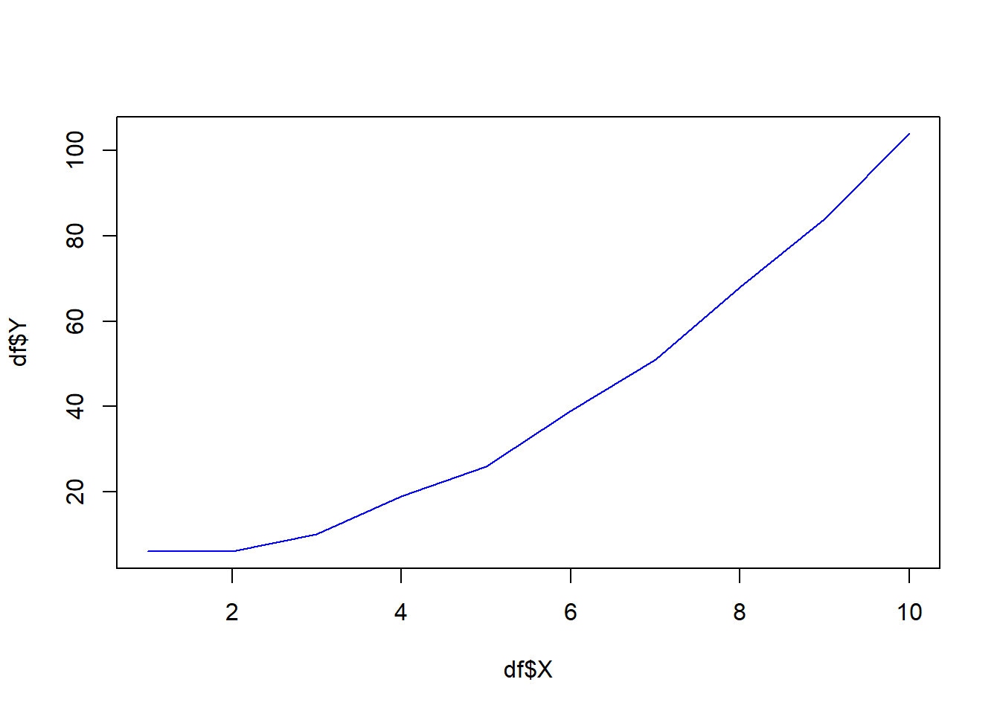
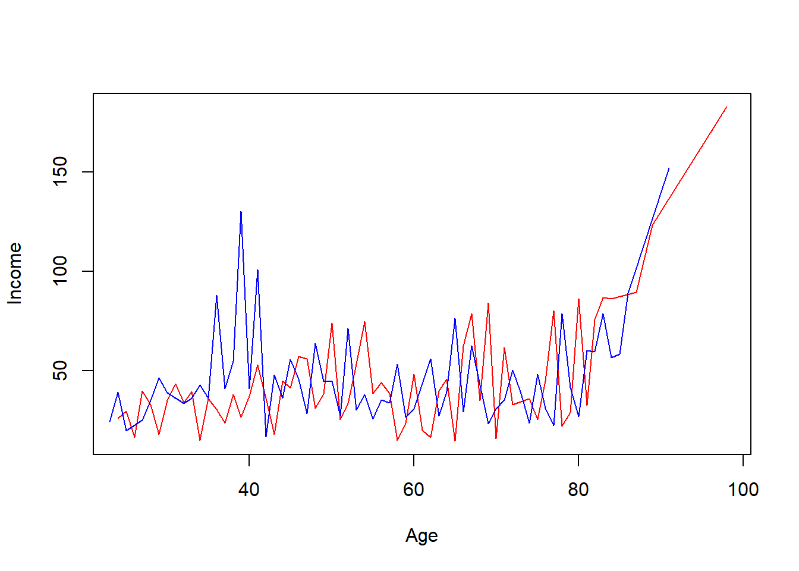

# Базові конструкції мови R: типи та структури даних. Частина 2 {#chapter3}

---

Автори: Новоселецький Олександр, Юрій Клебан

---

## План {-}

- [Набори даних](#chapter31)
- [Вектори (vectors)](#chapter32)
    - [Поняття та спосіб представлення](#chapter321)
    - [Оголошення векторів](#chapter322)
    - [Операції над векторами](#chapter323)
  
---

## Набори даних {#chapter31}

<div class="alert alert-danger">
<i class="fa-2x fas fa-alert fa-battery-quarter"></i>
Матеріали розділу у процесі підготовки.
</div>

## Вектори (vectors) {#chapter32}

### Поняття та спосіб представлення {#chapter321}

Вектори є найпростішим способом представлення колекції даних. З своїм змістом **вектор** - це послідовність однорідних елементів. Якщо ж говорити про мову програмування, то **вектор** - це послідовність елементів одного типу, що розміщені за деяким порядком (індексом).

Вектор прийнято позначати, як x = (x1, x2,..., xn), де х - назва вектора, n - кількість елементів вектора,

### Оголошення векторів {#chapter322}

Вектор - базовий тип даних у `R`, що дозволяє записати колекцію елементів одного типу за допомогою `c()` або без нього, якщо це послідовність значень. 

_Примітка. По суті функція `c()` дозволяє об'єднати кілька векторів._

Розглянемо для прикладу звичайну змінну `x`:

```r
x <- 10
```

По своїй суті `x` у даному випадку є вектором, що складається з одного значення `10`. Ми можемо також записати кілька елементів у змінну `x`:


```r
x <- c(1, 2, 2.5, 3)
x
```

```
## [1] 1.0 2.0 2.5 3.0
```

Елементами вектора можуть бути значення будь якого типу: `numeric`, `character`, `logical` тощо:


```r
v1 <- c(1, 3, 4, 6, 7)
v2 <- c(T, F, F, T, F)
v3 <- c("Hello", "my", "friend", "!")
```

Елементами вектора також послідовності, створені на за допомогою функцій `rep()`, `seq()` та оператора `:`:


```r
vtr <-  2:7
vtr
```

```
## [1] 2 3 4 5 6 7
```

```r
vtr <- 7:2
vtr
```

```
## [1] 7 6 5 4 3 2
```

Якщо є потреба об'єднати кілька векторів, скористайтеся функцією `c()`:


```r
x <- 2:3
y <- c(4,6,9)
z <- c(x, y, 10:12, 100)
z
```

```
## [1]   2   3   4   6   9  10  11  12 100
```

Переглянути коротку описову статистику по вектору можна за допомогою функції **`summary()`**:


```r
summary(z)
```

```
##    Min. 1st Qu.  Median    Mean 3rd Qu.    Max. 
##    2.00    4.00    9.00   17.44   11.00  100.00
```

### Операції над векторами {#chapter323}

The advantage of using vectors over writing each value in a separate variable is the ability to perform 1 operation on all elements of the vector or on several vectors simultaneously, for example, arithmetic operations of addition or multiplication.


```r
v1 <- c(1, 3, 5)
v1
```

```
## [1] 1 3 5
```

```r
v1 * 10
```

```
## [1] 10 30 50
```

From the example described above, it can be understood that the addition operation is essentially a super element sum of vectors when the 1st element of the vector v1 is added to the 1st element of the $vector2(1 + 2)$ and so on. Thus, the resulting vector will have the same length as the vectors $v1$ and $v2$.

However, there may be a situation when one of the vectors has a shorter length or even consists of 1 element:


```r
v1 <- c(1, 3, 5, 7)
v2 <- c(2, 4)
v1 + v2
```

```
## [1]  3  7  7 11
```


In this case, the number 2 will be added to each element of the vectorv1. In fact, this means that the vector v2 will look like c 2, 2), ie there will be a duplication of values to the length of the vectorv1 and then perform the operation of adding elements. Thus, the resulting vector will have the length of the longest of the vectors.

Consider a more complex case where there are vectors with different numbers of elements other than 1:


```r
v1 <- c(2, 3)
v2 <- c(4, 5, 6, 7)
v3 <- c(1, 8, 9)
v1 + v2 + v3
```

```
## Warning in v1 + v2 + v3: longer object length is not a multiple of shorter
## object length
```

```
## [1]  7 16 17 11
```


To begin with, it should be noted that the interpreter warns that the lengths of the vectors are not multiples (if they were vectors of length 2, 4, 8, then there would be no warning).

If you extend each vector to the length of the maximum of them, repeating the elements cyclically, you get a set (marked added elements):

```
v1 <- c(2, 3,*2,*3)
v2 <- c(4, 5, 6, 7)
v3 <- c(1, 8, 9,*1)
```

Subtraction (`-`), division(`/`) and multiplication (`*`) operations are performed similarly.

The relation operators and logical operators also act element by element with respect to the vector, but the result is a collection (vector) of values of the logical type logical with the values `TRUE/FALSE`.

Consider an example of finding all elements of the array $v1$ that are greater than the corresponding index elements of the array $v2$:


```r
v1 <- c(2, 4, 7, 9, 12)
v2 <- c(6, 4, 6, 7, 1)
v1 > v2
```

```
## [1] FALSE FALSE  TRUE  TRUE  TRUE
```


In essence, as a result of execution there is a comparison of each element of both vectors among themselves: `2>6`, `4>4`, `7>6`, `9>7`, `12>1`.

Therefore, the previously studied operators (`arithmetic`, `logical`, `relations`) can be used to work with vectors as well.


### Naming vector elements


In order to understand what vectors mean and what data is often described, analysts need to sign this data.

We will write down information about daily visits to the site by users during the week in the following way:


```r
# Count of unique bank branch visits from Monday to Sunday
data <- c(1245, 2112, 1321, 1231, 2342, 1718, 1980)
```

Next, assign values to the days of the week using the `names()` function:


```r
names(data) <- c("Monday", "Tuesday", "Wednesday", "Thursday", "Friday", "Saturday", "Sunday")
print(data)
```

```
##    Monday   Tuesday Wednesday  Thursday    Friday  Saturday    Sunday 
##      1245      2112      1321      1231      2342      1718      1980
```

Otherwise, this code could be written as follows:


```r
data <- c(1245, 2112, 1321, 1231, 2342, 1718, 1980)
days <- c("Monday", "Tuesday", "Wednesday", "Thursday", "Friday", "Saturday", "Sunday")
names(data) <- days
data
```

```
##    Monday   Tuesday Wednesday  Thursday    Friday  Saturday    Sunday 
##      1245      2112      1321      1231      2342      1718      1980
```

If we need to get information, for example, about the name of the 4th element of the vector, we can use the code:


```r
names(data)
```

```
## [1] "Monday"    "Tuesday"   "Wednesday" "Thursday"  "Friday"    "Saturday" 
## [7] "Sunday"
```

The `names()` function allows not only to set the values of names for vector elements, but also to obtain information about them.

---

### Access to vector elements


Indexing of elements inside the wind occurs from 1 ton, where n is the number of elements of the vector.

_Note. In R, the indexing of array, vector, and all other collection types begins with 1, not with 0._

Consider the previous example:


```r
data <- c(1245, 2112, 1321, 1231, 2342, 1718, 1980)
days <- c("Monday", "Tuesday", "Wednesday", "Thursday", "Friday", "Saturday", "Sunday")
names(data) <- days
```

In order to record information only about site visitors on Wednesday, you need to use the operator `[]` and specify the index of the element in the array:


```r
data[3]
```

```
## Wednesday 
##      1321
```

```r
data[names(data) == 'Wednesday']
```

```
## Wednesday 
##      1321
```


If there is a need to get several elements of the vector that are out of order, you can do it like this:


```r
some_days <- data[c(1, 2, 5)]
some_days
```

```
##  Monday Tuesday  Friday 
##    1245    2112    2342
```

From the example above it is clear that the indices of the vector data are another vector `c(1, 2, 5)`, so it can be declared as a separate variable:


```r
indexes <- c(1, 2, 5)
some_days <- data[indexes]
some_days
```

```
##  Monday Tuesday  Friday 
##    1245    2112    2342
```

If there is a need to obtain information about several elements that are placed in a row, then for convenience (and in the case when such an array consists, for example, of 1000+ elements) use the operator :, for example:


```r
working_days <- data[1:5]
working_days
```

```
##    Monday   Tuesday Wednesday  Thursday    Friday 
##      1245      2112      1321      1231      2342
```

Thus, all working days of the week are selected for the working_days vector.

---

### Useful functions

Let's take a look at some useful features that will simplify working with vectors. For further calculations we will use two vectors A andB:


```r
A <- c(3, 5, 8, 2, 5, 4, 2)
B <- c(3, NA, 1, NA, 6, 4, 5)
A
```

```
## [1] 3 5 8 2 5 4 2
```

```r
B
```

```
## [1]  3 NA  1 NA  6  4  5
```

Function sum(). This function is used to find the sum of the elements of the collection:


```r
sum(A)
```

```
## [1] 29
```

```r
sum(B)
```

```
## [1] NA
```

An interesting point is that in the presence of gaps in the data (value NA) the calculation of the amount is impossible. In this case, the functions can take the additional parameter na.rm = T, whereT is an abbreviation of TRUE, which indicates the need to remove gaps in the data before performing the operation

_Note. You should check the documentation for such a parameter in the function. If it is not present, then it is necessary to carry out cleaning in other ways before work with the data._


```r
sum(B, na.rm = T)
```

```
## [1] 19
```

The mean () function is used to find the arithmetic mean of numbers:


```r
mean(A)
```

```
## [1] 4.142857
```

```r
mean(B, na.rm = T)
```

```
## [1] 3.8
```

min() and max() functions allow you to find the minimum and maximum values, respectively:


```r
min(A)
```

```
## [1] 2
```

```r
max(A)
```

```
## [1] 8
```

Also to work in R there is a large number of built-in implemented functions to perform statistical, econometric and other research in the field of economics and beyond. Try the sd(), cov(), cor() functions.

The length () function helps to determine the "length" of a vector, ie the number of elements:


```r
length(A)
```

```
## [1] 7
```

```r
length(B)
```

```
## [1] 7
```

The unique () function identifies unique elements in an array:


```r
A
```

```
## [1] 3 5 8 2 5 4 2
```

```r
unique(A)
```

```
## [1] 3 5 8 2 4
```

```r
print("---")
```

```
## [1] "---"
```

```r
B
```

```
## [1]  3 NA  1 NA  6  4  5
```

```r
unique(B)
```

```
## [1]  3 NA  1  6  4  5
```

The intersect() function allows you to find common elements of two vectors, so for vectors A andB common values are 3, 4 and5:


```r
A
```

```
## [1] 3 5 8 2 5 4 2
```

```r
B
```

```
## [1]  3 NA  1 NA  6  4  5
```

```r
intersect(A, B)
```

```
## [1] 3 5 4
```

Conversely, The union() function allows you to combine elements of both sets / vectors:


```r
A
```

```
## [1] 3 5 8 2 5 4 2
```

```r
B
```

```
## [1]  3 NA  1 NA  6  4  5
```

```r
union(A, B)
```

```
## [1]  3  5  8  2  4 NA  1  6
```

Try to understand the operation of the functions setdiff(), setequal(), is.element().

_I recommend reading the short materials here: https://stat.ethz.ch/R-manual/R-devel/library/base/html/sets.html._

---

### Correction of data (NA, NaN, Inf)

In the process of working with data there are problems associated with the correctness of their reading, conversion and operations on them. For example, an incorrect entry in the field of integer type " +10 " instead of 10 may result in conversion toNaN or division by 0 toInf.

Before using numerical and other data, the stage of cleaning and replacement of values is usually performed depending on the tasks of programming / research. In R the following types of the missed values are possible:

- [x] NA ** - Not Available.
- [x] NaN ** - Not a Number.
- [x] Inf ** - Infinity (infinity, can be with the sign+and-).

Let's start with vector:


```r
vtr <- c(1, -2, NA, NaN, Inf, 1223, -Inf, NA, 21) 
vtr
```

```
## [1]    1   -2   NA  NaN  Inf 1223 -Inf   NA   21
```

You can check a single value for a space with the functions is.na(), is.nan(), is.infinite(), is.finite().


```r
is.na(vtr)
```

```
## [1] FALSE FALSE  TRUE  TRUE FALSE FALSE FALSE  TRUE FALSE
```

```r
is.nan(vtr)
```

```
## [1] FALSE FALSE FALSE  TRUE FALSE FALSE FALSE FALSE FALSE
```

```r
is.infinite(vtr)
```

```
## [1] FALSE FALSE FALSE FALSE  TRUE FALSE  TRUE FALSE FALSE
```

```r
is.finite(vtr) # if infinite == TRUE => finite == FALSE :)
```

```
## [1]  TRUE  TRUE FALSE FALSE FALSE  TRUE FALSE FALSE  TRUE
```

Then replacement of values can be executed as follows (we will replace all NA and Nan with 1000):


```r
vtr[is.na(vtr)] <- 1000
vtr
```

```
## [1]    1   -2 1000 1000  Inf 1223 -Inf 1000   21
```

```r
## Nan also replaced with is.na()!!!
```

And then replace Inf with the maximum value in the vector, and -Inf with the minimum:


```r
vtr[is.nan(vtr)] <- 500
vtr
```

```
## [1]    1   -2 1000 1000  Inf 1223 -Inf 1000   21
```

```r
vtr[is.na(vtr)] <- 1000
vtr
```

```
## [1]    1   -2 1000 1000  Inf 1223 -Inf 1000   21
```

```r
## Nan also replaced with is.na()!!!
```

And then replace Inf with the maximum value in the vector, and -Inf with the minimum:


```r
vtr <- c(1, -2, NA, NaN, Inf, 1223, -Inf, NA, 21) 
vtr
```

```
## [1]    1   -2   NA  NaN  Inf 1223 -Inf   NA   21
```

```r
is.infinite(vtr)
```

```
## [1] FALSE FALSE FALSE FALSE  TRUE FALSE  TRUE FALSE FALSE
```

```r
!is.infinite(vtr)
```

```
## [1]  TRUE  TRUE  TRUE  TRUE FALSE  TRUE FALSE  TRUE  TRUE
```

```r
vtr[!is.infinite(vtr)]
```

```
## [1]    1   -2   NA  NaN 1223   NA   21
```

```r
max(vtr[!is.infinite(vtr)], na.rm = T)
```

```
## [1] 1223
```

```r
max(vtr, na.rm = T)
```

```
## [1] Inf
```

```r
min(vtr, na.rm = T)
```

```
## [1] -Inf
```

```r
vtr[vtr == Inf] <- max(vtr)
vtr[vtr == -Inf] <- min(vtr)
vtr
```

```
## [1]    1   -2   NA  NaN   NA 1223   NA   NA   21
```

If you want to replace the value in Inf regardless of the sign, you can useis.infinite().

---

### Tasks

*Task 1*

- [x] Create vector of 10 random number in range $[10;100]$
- [x] Replace all odd numbers with NA
- [x] Replace all NA with average value

*Solution*


```r
x <- sample(1:100, size = 10)
x
```

```
##  [1] 55 60 21 31 83 42 20 46 18 70
```


```r
x[x %% 2 != 0] <- NA
x
```

```
##  [1] NA 60 NA NA NA 42 20 46 18 70
```


```r
x[is.na(x)] <- mean(x, na.rm = T)
x
```

```
##  [1] 42.66667 60.00000 42.66667 42.66667 42.66667 42.00000 20.00000 46.00000
##  [9] 18.00000 70.00000
```

---

## 2. Matrices

### Creating matrices

Matrix - a collection of elements of the same type (numeric,character, logical) with a fixed set of rows and columns. In the case where the matrix has only rows and columns, it is a two-dimensional data array.

The matrix is created using the matrix() function:


```r
matrix(1:10, byrow = TRUE, nrow = 2)
```

```
##      [,1] [,2] [,3] [,4] [,5]
## [1,]    1    2    3    4    5
## [2,]    6    7    8    9   10
```

where `1:10` - a set of elements of the matrix, it can also be a pre-formed vector (entered, by calculation, from a file, etc.), `byrow = TRUE` - means that the elements in the matrix will be written in rows, so in the pedestrian line contains the value `1:5`, and the second `6:10` (if we need to write information on the lines then we should use `byrow = FASLE`), `nrow` - the number of rows of the matrix.


```r
sales1 <- c(12, 14, 15)
sales2 <- c(22, 15, 21)
sales <- c(sales1, sales2)
m <- matrix(sales, byrow= T, nrow = 2)
m
```

```
##      [,1] [,2] [,3]
## [1,]   12   14   15
## [2,]   22   15   21
```

---

### Naming matrices

To specify the names of rows and columns of the matrix, use the functions rownames() and colnames():


```r
m <- matrix(1:9, nrow = 3)
rownames(m) <- c("row1", "row2", "row3")
colnames(m) <- c("c1", "c2", "c3")
m
```

```
##      c1 c2 c3
## row1  1  4  7
## row2  2  5  8
## row3  3  6  9
```

---

Add rows and columns

Special methods cbind/rbind are used to change the number of elements in rows and columns of matrices, as well as to quickly combine them.

The cbind function allows you to add one or more matrices and/or vectors behind one of the columns. That is, there is not a simple connection, but a comparison by key field. Consider an example:


```r
m1 <- matrix(c(1:3, 101:103), nrow = 3)
colnames(m1) <- c("A", "B")

m2 <- matrix(c(201:203, 1001:1003), nrow = 3)
colnames(m2) <- c("C", "D")

m_bind <- cbind(m1, m2)

m1
```

```
##      A   B
## [1,] 1 101
## [2,] 2 102
## [3,] 3 103
```

```r
m2
```

```
##        C    D
## [1,] 201 1001
## [2,] 202 1002
## [3,] 203 1003
```

```r
m_bind
```

```
##      A   B   C    D
## [1,] 1 101 201 1001
## [2,] 2 102 202 1002
## [3,] 3 103 203 1003
```

---

### Access to matrix elements

The elements of the matrix are accessed by the index of rows and columns. You can select ranges in a similar way to vectors.

Let's look at an example:


```r
m <- matrix(11:25, nrow = 3)
m
```

```
##      [,1] [,2] [,3] [,4] [,5]
## [1,]   11   14   17   20   23
## [2,]   12   15   18   21   24
## [3,]   13   16   19   22   25
```

To display the 10th element of the matrix, you can use the entries (note that the account is from the right left corner of the columns):


```r
m[10]    
```

```
## [1] 20
```

```r
m[[10]]
```

```
## [1] 20
```

To display the same element using row and column indexes, write as follows:


```r
# Row #1
# Column #4
m[1,4]
```

```
## [1] 20
```

Question: What record should you use ti get 18?

Answer: m[2,3]


```r
m[2,3]
```

```
## [1] 18
```

If you want to output / use an entire row or a whole column, then the block with the index of unnecessary dimensionality can be left blank:


```r
m[1, ] # first row only
```

```
## [1] 11 14 17 20 23
```

```r
m[c(1,3), ] # first and third row only
```

```
##      [,1] [,2] [,3] [,4] [,5]
## [1,]   11   14   17   20   23
## [2,]   13   16   19   22   25
```


```r
m[, 1] # first column only
```

```
## [1] 11 12 13
```

```r
m[, c(1,3)] # first and third column only
```

```
##      [,1] [,2]
## [1,]   11   17
## [2,]   12   18
## [3,]   13   19
```

You can also specify a list of rows and columns to be output / received simultaneously:


```r
m[c(1,3), 2:4]
```

```
##      [,1] [,2] [,3]
## [1,]   14   17   20
## [2,]   16   19   22
```

You can exclude individual columns or rows by using indexes with minus signs (-):


```r
m[-1, c(-2:-3)]
```

```
##      [,1] [,2] [,3]
## [1,]   12   21   24
## [2,]   13   22   25
```

---

### Useful functions

Matrix dimmentions

To obtain information about the dimensions of the table, there are special functions: nrow(), ncol(), dim():


```r
# Decalre matrix
m <- matrix(1:15, ncol = 3)
m
```

```
##      [,1] [,2] [,3]
## [1,]    1    6   11
## [2,]    2    7   12
## [3,]    3    8   13
## [4,]    4    9   14
## [5,]    5   10   15
```

```r
print(paste("Rows:", nrow(m)))
```

```
## [1] "Rows: 5"
```

```r
print(paste("Cols:", ncol(m)))
```

```
## [1] "Cols: 3"
```

```r
print(paste("Dim:", paste0(dim(m), collapse = " x ")))
```

```
## [1] "Dim: 5 x 3"
```

Using nrow() andncol() allows you to access the last row and column of the matrix, respectively:


```r
m[nrow(m), ] # last row
```

```
## [1]  5 10 15
```

```r
m[, ncol(m)] # last colum
```

```
## [1] 11 12 13 14 15
```

---

## 3. Factors

Factors in R programming allow you to represent a vector of values as categorical values, rather than just a set of text data or numbers. The advantage of the categorical data type is that the element can take only a limited number of values, and not any value that allows the data type.

For example, a numeric vector may contain an infinitely large variation of the values c(1, 0.021, 192.1444, ..., etc.), the character sets may also be different c ("sdf & Tg6","sdf * Y & 65"). The number of combinations of such vectors is very large.

In the case of categories, we are talking about certain fixed values. A good example is forms that are filled out on sites with drop-down lists, where the user cannot enter a value, but only select from an existing list. So in the gender field there is usually a limited set of possible options: Male,Female, Other. The user can select only one of these values ​​and does not have the ability to enter something else (this is an example, each resource can make different forms for users).

Creation of factors in R occurs by means of function factor():


```r
gender <- c("Male", "Female", "Other", "Male", "Female", "Male", "Female", "Female")
gender 
```

```
## [1] "Male"   "Female" "Other"  "Male"   "Female" "Male"   "Female" "Female"
```

```r
gender_factor <- factor(gender)
gender_factor
```

```
## [1] Male   Female Other  Male   Female Male   Female Female
## Levels: Female Male Other
```

When creating a factor, each unique element gets its own digital? (from the outside it looks like this, it needs to be clarified) value inside the collection, this value is called the level (level). In the previous example, the variable gender _factor received the levels Female, Male, Other in alphabetical order. If we convert factors to numbers, we get:


```r
as.numeric(gender_factor)
```

```
## [1] 2 1 3 2 1 2 1 1
```

gender Thus it is clear that Female = 1, Male = 2, Other = 3. Consider a situation where we get data in which the order of values in the factor collection is different, for example, we need to specify so that Male = 1, Female = 2, Other = 3:


```r
gender <- c("Male", "Female", "Other", "Male", "Female", "Male", "Female", "Female")
gender_factor <- factor(gender, levels = c("Male", "Female", "Other"))
gender_factor
```

```
## [1] Male   Female Other  Male   Female Male   Female Female
## Levels: Male Female Other
```

```r
lvl <- levels(gender_factor) # read levels of factor
seq_along(lvl)
```

```
## [1] 1 2 3
```

```r
as.integer(lvl)
```

```
## Warning: NAs introduced by coercion
```

```
## [1] NA NA NA
```

```r
as.numeric(gender_factor)
```

```
## [1] 1 2 3 1 2 1 2 2
```

Now the order of the levels corresponds to ours and this will allow us to successfully combine our collection with similar ones that have the same set of values.

Sometimes it is necessary to change not only the order of the elements in the factorial collection, but also their names. Let's consider a situation when we need to rename values Male,Female, Other inM, F,O:


```r
gender <- c("Male", "Female", "Other", "Male", "Female", "Male", "Female", "Female")
gender_factor <- factor(gender, levels = c("Male", "Female", "Other"))
levels(gender_factor) <- c("M", "F", "O")
gender_factor
```

```
## [1] M F O M F M F F
## Levels: M F O
```

But you should check you type with is.factor() before converting to numbers:


```r
cities <- c("Rivne", "Ostroh", "Zdolbuniv", "Dubno", "Sarny")
cities_as_factors <- factor(cities)
as.numeric(cities_as_factors)
```

```
## [1] 3 2 5 1 4
```

```r
as.numeric(cities) # you cannot convert characters vector to numerics
```

```
## Warning: NAs introduced by coercion
```

```
## [1] NA NA NA NA NA
```

---

## 4. Dataframes

Data frames are the most popular data structure in R, becouse it allows collect data with different columns type in one object and quickly manipulate it.

A data frame, a matrix-like structure whose columns may be of differing types (numeric, logical, factor and character and so on).

The function data.frame() creates data frames, tightly coupled collections of variables which share many of the properties of matrices and of lists, used as the fundamental data structure by most of R's modeling software.

*Syntax*

{r}
data.frame(..., row.names = NULL, check.rows = FALSE,
           check.names = TRUE, fix.empty.names = TRUE,
           stringsAsFactors = FALSE)
           
*Arguments* (top useful)

- [x] ... - these arguments are of either the form value or tag = value. Component names are created based on the tag (if present) or the deparsed argument itself.
- [x] row.names - NULL or a single integer or character string specifying a column to be used as row names, or a character or integer vector giving the row names for the data frame.
- [x] stringsAsFactors - logical: should character vectors be converted to factors? The ‘factory-fresh’ default has been TRUE previously but has been changed to FALSE

*Details*

A data frame is a list of variables of the same number of rows with unique row names, given class data.frame. If no variables are included, the row names determine the number of rows.

data.frame converts each of its arguments to a data frame by calling as.data.frame(optional = TRUE). As that is a generic function, methods can be written to change the behaviour of arguments according to their classes: R comes with many such methods. Character variables passed to data.frame are converted to factor columns unless protected argument stringsAsFactors is false. If a list or data frame or matrix is passed to data.frame it is as if each component or column had been passed as a separate argument.

---

## Creating Data Frames

Data frames are usually created by reading in a dataset from file, scraping from websites. However, data frames can also be created explicitly with the data.frame() function or they can be coerced from other types of objects like lists. In this case I’ll create a simple data frame df and assess its basic structure:


```r
df <- data.frame(id = 1:5,
                char_col = c("a", "b", "c", "d", "e"),
                log_col = c(T,T,T,F,T),
                double_col = c(2.1, 1, 0.5, pi, 12.7))
df
```

```
##   id char_col log_col double_col
## 1  1        a    TRUE   2.100000
## 2  2        b    TRUE   1.000000
## 3  3        c    TRUE   0.500000
## 4  4        d   FALSE   3.141593
## 5  5        e    TRUE  12.700000
```


```r
# assess the structure of a data frame
str(df)
```

```
## 'data.frame':	5 obs. of  4 variables:
##  $ id        : int  1 2 3 4 5
##  $ char_col  : chr  "a" "b" "c" "d" ...
##  $ log_col   : logi  TRUE TRUE TRUE FALSE TRUE
##  $ double_col: num  2.1 1 0.5 3.14 12.7
```


```r
# number of rows
nrow(df)
```

```
## [1] 5
```


```r
# number of columns
ncol(df)
```

```
## [1] 4
```


```r
df <- data.frame(i = 1:5,
                char_col = c("a", "b", "c", "d", "e"),
                log_col = c(T,T,T,F,T),
                double_col = c(2.1, 1, 0.5, pi, 12.7),
                stringsAsFactors = TRUE) # warning it depends on local settings of R
df
```

```
##   i char_col log_col double_col
## 1 1        a    TRUE   2.100000
## 2 2        b    TRUE   1.000000
## 3 3        c    TRUE   0.500000
## 4 4        d   FALSE   3.141593
## 5 5        e    TRUE  12.700000
```

Creating data.frames from lists (P.S. lists explained in next chapter):

```
demo_list <- list(int_col = v_int,
                  char_col = v_char,
                  log_col = v_log,
                  double_col = v_double)
as.data.frame(demo_list)
```

Matrix can be base for data frame too:


```r
demo_matrix <- matrix(100:119, nrow = 5, ncol = 4)
demo_matrix
```

```
##      [,1] [,2] [,3] [,4]
## [1,]  100  105  110  115
## [2,]  101  106  111  116
## [3,]  102  107  112  117
## [4,]  103  108  113  118
## [5,]  104  109  114  119
```

```r
as.data.frame(demo_matrix)
```

```
##    V1  V2  V3  V4
## 1 100 105 110 115
## 2 101 106 111 116
## 3 102 107 112 117
## 4 103 108 113 118
## 5 104 109 114 119
```

---

### Extending data frames

You can add rows and columns to data frame. Merging two data frames by selected column values awailable too.

cbind() adds new column


```r
df <-  data.frame(A1 = c("A", "B", "C"),
                  A2 = c("D", "E", "F"))
df
```

```
##   A1 A2
## 1  A  D
## 2  B  E
## 3  C  F
```

```r
A3 = c(1, 2, 3)
cbind(df, A3)
```

```
##   A1 A2 A3
## 1  A  D  1
## 2  B  E  2
## 3  C  F  3
```

```r
colnames(df)
```

```
## [1] "A1" "A2"
```

```r
colnames(df) <- c("B1", "B2")
colnames(df)
```

```
## [1] "B1" "B2"
```

rbind() adds new row


```r
letters_frame <-  data.frame(A1 = c("A", "B", "C"),
                            A2 = 1:3)
letters_frame
```

```
##   A1 A2
## 1  A  1
## 2  B  2
## 3  C  3
```

```r
next_row = c("D", 4) # data types by row should be the same as in initial data frame
rbind(letters_frame, next_row)
```

```
##   A1 A2
## 1  A  1
## 2  B  2
## 3  C  3
## 4  D  4
```

### Merge DF

Data frames could me merged by key with merge():


```r
df1 <- data.frame(Id = c(1:4),
                  Name = c("Nick", "Jake", "Jane", "Mary"))
df1
```

```
##   Id Name
## 1  1 Nick
## 2  2 Jake
## 3  3 Jane
## 4  4 Mary
```

```r
df2 <- data.frame(Id = c(2, 1, 3, 5), # defferent order from Id in df1
                  Age = c(34, 21, 45, 20))
df2
```

```
##   Id Age
## 1  2  34
## 2  1  21
## 3  3  45
## 4  5  20
```

```r
df_final <- merge(df1, df2, by = "Id", all.x = F, all.y = F)
df_final
```

```
##   Id Name Age
## 1  1 Nick  21
## 2  2 Jake  34
## 3  3 Jane  45
```

---

### Subsetting Data Frames

Data frames possess the characteristics of both lists and matrices: if you subset with a single vector, they behave like lists and will return the selected columns with all rows; if you subset with two vectors, they behave like matrices and can be subset by row and column:


```r
df <- data.frame(int_col = 1:5,
                char_col = c("a", "b", "c", "d", "e"),
                log_col = c(T,T,T,F,T),
                double_col = c(2.1, 1, 0.5, pi, 12.7),
                row.names = paste0("row_", 1:5), # setting row names 
                stringsAsFactors = TRUE) # warning it depends on local settings of R
df
```

```
##       int_col char_col log_col double_col
## row_1       1        a    TRUE   2.100000
## row_2       2        b    TRUE   1.000000
## row_3       3        c    TRUE   0.500000
## row_4       4        d   FALSE   3.141593
## row_5       5        e    TRUE  12.700000
```


```r
# select columns using $ sign
df$log_col
```

```
## [1]  TRUE  TRUE  TRUE FALSE  TRUE
```


```r
# subsetting by row numbers
df[1, ] # first row
```

```
##       int_col char_col log_col double_col
## row_1       1        a    TRUE        2.1
```

```r
df[nrow(df), ] # last row
```

```
##       int_col char_col log_col double_col
## row_5       5        e    TRUE       12.7
```

```r
df[-1, ] # all except first row
```

```
##       int_col char_col log_col double_col
## row_2       2        b    TRUE   1.000000
## row_3       3        c    TRUE   0.500000
## row_4       4        d   FALSE   3.141593
## row_5       5        e    TRUE  12.700000
```


```r
# subsetting by row names
df[c("row_4", "row_5"), ]
```

```
##       int_col char_col log_col double_col
## row_4       4        d   FALSE   3.141593
## row_5       5        e    TRUE  12.700000
```


```r
# subsetting columns like a list
df[, c("log_col", "double_col")]
```

```
##       log_col double_col
## row_1    TRUE   2.100000
## row_2    TRUE   1.000000
## row_3    TRUE   0.500000
## row_4   FALSE   3.141593
## row_5    TRUE  12.700000
```


```r
# subset for both rows and columns
df[2:5, c(1, 3:4)]
```

```
##       int_col log_col double_col
## row_2       2    TRUE   1.000000
## row_3       3    TRUE   0.500000
## row_4       4   FALSE   3.141593
## row_5       5    TRUE  12.700000
```


```r
# select only with log_col == TRUE
df[df$double_col > 1, ]
```

```
##       int_col char_col log_col double_col
## row_1       1        a    TRUE   2.100000
## row_4       4        d   FALSE   3.141593
## row_5       5        e    TRUE  12.700000
```

```r
df[!df$log_col, ]
```

```
##       int_col char_col log_col double_col
## row_4       4        d   FALSE   3.141593
```


```r
"s" %in% c("s", "t")
```

```
## [1] TRUE
```


```r
# select only with char_col == 'a', 'e'
chars <- df$char_col %in% c("a", "e")
chars
```

```
## [1]  TRUE FALSE FALSE FALSE  TRUE
```

```r
sum(chars)
```

```
## [1] 2
```

```r
df[chars, ] # %in% operator for check multuiple values
```

```
##       int_col char_col log_col double_col
## row_1       1        a    TRUE        2.1
## row_5       5        e    TRUE       12.7
```


```r
# select only with double_col > 1 and log_col == TRUE
df[df$log_col == TRUE & df$double_col > 1, ]
```

```
##       int_col char_col log_col double_col
## row_1       1        a    TRUE        2.1
## row_5       5        e    TRUE       12.7
```


```r
# select only specific columns with double_col > 1 and log_col == TRUE
df[df$log_col == TRUE & df$double_col > 1, c("log_col", "int_col", "double_col")]
```

```
##       log_col int_col double_col
## row_1    TRUE       1        2.1
## row_5    TRUE       5       12.7
```

---

### Order data.frame

Let's use our previous sample data.frame but with unordered values:


```r
df <- data.frame(int_col = c(1, 5, 3, 4, 2),
                char_col = c("b", "a", "a", "d", "e"),
                log_col = c(T,T,T,F,T),
                double_col = c(2.1, 1, 0.5, pi, 12.7),
                row.names = paste0("row_", 1:5), # setting row names 
                stringsAsFactors = TRUE) # warning it depends on local settings of R
df
```

```
##       int_col char_col log_col double_col
## row_1       1        b    TRUE   2.100000
## row_2       5        a    TRUE   1.000000
## row_3       3        a    TRUE   0.500000
## row_4       4        d   FALSE   3.141593
## row_5       2        e    TRUE  12.700000
```

You can use order() function for sorting data.frames.


```r
# sort by int_col
order(df$char_col)
```

```
## [1] 2 3 1 4 5
```

```r
order(df$int_col)
```

```
## [1] 1 5 3 4 2
```

```r
df[order(df$char_col),]
```

```
##       int_col char_col log_col double_col
## row_2       5        a    TRUE   1.000000
## row_3       3        a    TRUE   0.500000
## row_1       1        b    TRUE   2.100000
## row_4       4        d   FALSE   3.141593
## row_5       2        e    TRUE  12.700000
```

Use - minus to sort descending


```r
# sort by double_col
# rev
df[rev(order(df$int_col)), ]
```

```
##       int_col char_col log_col double_col
## row_2       5        a    TRUE   1.000000
## row_4       4        d   FALSE   3.141593
## row_3       3        a    TRUE   0.500000
## row_5       2        e    TRUE  12.700000
## row_1       1        b    TRUE   2.100000
```

You can also sor by multiple columns with order(column1, column2) or order(column1, -column2).

### Manipulating data.frames


---

### Tasks on data.frames

*Task 1*
Write a code evaluates $y = x^2 + e, where x is a random number in range [0; 1].

Print calculation result as data.frame with columns X, E, Y.

Use plot() funtion to visualize X vs Y as line chart (type = l or b).

*Solution*


```r
# initiate data.frame
df <- data.frame(X = 1:10,
                 E = sample(5, 10, replace = T),
                 Y = NA)
head(df)
```

```
##   X E  Y
## 1 1 5 NA
## 2 2 1 NA
## 3 3 3 NA
## 4 4 2 NA
## 5 5 3 NA
## 6 6 1 NA
```


```r
df$Y <- with(df, X^2 + E)
head(df)
```

```
##   X E  Y
## 1 1 5  6
## 2 2 1  5
## 3 3 3 12
## 4 4 2 18
## 5 5 3 28
## 6 6 1 37
```


```r
plot(df$X, df$Y, type="l", col = "blue")
```



*Task 2*

1. Install package and load package ISLR
2. Save dataset Credit into variable credit_data.
3. Check dataset structure with str() function.
4. Convert Student status "yes/no" to 1/0
5. Order dataset by Rating descending
6. Filter only Age > 50 with Rating > 400, how many records do you get?
7. Evaluate average Income for Married = YES Married = NO with Age in range [20,30]
7.1 Make the same for Age [30;40] Any conclusion?

*Solution*


```r
# 1. install.package ISLR
#install.packages("ISLR")
library(ISLR)
```


```r
# 2. Save dataset `Credit` into variable `credit_data`.
credit_data <- ISLR::Credit
head(credit_data, 3)
```

```
##   ID  Income Limit Rating Cards Age Education Gender Student Married Ethnicity
## 1  1  14.891  3606    283     2  34        11   Male      No     Yes Caucasian
## 2  2 106.025  6645    483     3  82        15 Female     Yes     Yes     Asian
## 3  3 104.593  7075    514     4  71        11   Male      No      No     Asian
##   Balance
## 1     333
## 2     903
## 3     580
```


```r
# 3. Check dataset structure with `str()` function.
str(credit_data)
```

```
## 'data.frame':	400 obs. of  12 variables:
##  $ ID       : int  1 2 3 4 5 6 7 8 9 10 ...
##  $ Income   : num  14.9 106 104.6 148.9 55.9 ...
##  $ Limit    : int  3606 6645 7075 9504 4897 8047 3388 7114 3300 6819 ...
##  $ Rating   : int  283 483 514 681 357 569 259 512 266 491 ...
##  $ Cards    : int  2 3 4 3 2 4 2 2 5 3 ...
##  $ Age      : int  34 82 71 36 68 77 37 87 66 41 ...
##  $ Education: int  11 15 11 11 16 10 12 9 13 19 ...
##  $ Gender   : Factor w/ 2 levels " Male","Female": 1 2 1 2 1 1 2 1 2 2 ...
##  $ Student  : Factor w/ 2 levels "No","Yes": 1 2 1 1 1 1 1 1 1 2 ...
##  $ Married  : Factor w/ 2 levels "No","Yes": 2 2 1 1 2 1 1 1 1 2 ...
##  $ Ethnicity: Factor w/ 3 levels "African American",..: 3 2 2 2 3 3 1 2 3 1 ...
##  $ Balance  : int  333 903 580 964 331 1151 203 872 279 1350 ...
```


```r
# Convert Student status "yes/no" to 1/0

as.numeric(credit_data$Student) - 1
```

```
##   [1] 0 1 0 0 0 0 0 0 0 1 0 0 0 0 0 0 0 0 0 0 0 0 0 0 0 0 1 0 0 0 0 0 0 0 0 1 0
##  [38] 0 0 0 0 1 0 0 0 0 1 1 0 1 0 0 0 0 0 0 0 0 0 0 0 0 0 0 0 0 0 0 0 0 0 0 0 0
##  [75] 0 0 1 0 0 0 0 0 0 0 0 0 0 0 0 0 0 0 0 0 0 0 1 0 1 0 0 1 1 0 0 0 0 0 0 0 0
## [112] 0 0 0 0 0 0 0 0 0 0 0 0 0 0 0 1 0 1 0 1 0 0 0 0 0 0 0 0 0 1 0 0 0 0 0 0 0
## [149] 0 0 0 0 1 0 0 0 0 1 0 0 0 0 0 0 0 0 0 0 0 0 0 0 0 0 0 0 0 0 0 0 0 0 0 0 0
## [186] 0 0 0 0 0 0 1 0 0 0 0 0 0 0 0 0 0 0 1 0 0 0 1 0 0 0 0 0 0 0 0 0 0 1 0 1 0
## [223] 1 0 0 0 0 0 0 0 0 0 0 0 0 0 0 0 0 0 0 0 1 0 0 0 0 0 1 1 0 0 0 0 0 0 0 0 0
## [260] 0 0 1 0 0 0 0 0 0 0 0 0 0 1 1 0 0 0 0 0 1 0 0 0 0 0 0 0 0 0 0 0 0 0 0 0 0
## [297] 0 0 0 0 0 0 0 0 0 0 0 0 0 0 1 0 0 0 0 0 0 0 0 0 1 0 0 0 1 0 0 0 0 0 1 0 0
## [334] 0 0 0 0 0 0 0 0 0 0 0 0 0 0 0 0 0 0 0 0 0 0 0 0 0 0 0 0 0 0 0 0 1 0 0 0 0
## [371] 0 0 1 1 0 0 0 0 0 0 0 0 1 0 0 0 0 0 0 0 0 0 0 0 0 0 0 0 0 0
```

```r
credit_data$Student <- as.character(credit_data$Student) # convert to character first / factors
credit_data$Student <- ifelse(credit_data$Student == "Yes", 1, 0)

head(credit_data)
```

```
##   ID  Income Limit Rating Cards Age Education Gender Student Married Ethnicity
## 1  1  14.891  3606    283     2  34        11   Male       0     Yes Caucasian
## 2  2 106.025  6645    483     3  82        15 Female       1     Yes     Asian
## 3  3 104.593  7075    514     4  71        11   Male       0      No     Asian
## 4  4 148.924  9504    681     3  36        11 Female       0      No     Asian
## 5  5  55.882  4897    357     2  68        16   Male       0     Yes Caucasian
## 6  6  80.180  8047    569     4  77        10   Male       0      No Caucasian
##   Balance
## 1     333
## 2     903
## 3     580
## 4     964
## 5     331
## 6    1151
```


```r
# 5. Order dataset by `Rating` descending
credit_data <- credit_data[order(-credit_data$Rating), ]
head(credit_data)
```

```
##      ID  Income Limit Rating Cards Age Education Gender Student Married
## 324 324 182.728 13913    982     4  98        17   Male       0     Yes
## 29   29 186.634 13414    949     2  41        14 Female       0     Yes
## 356 356 180.682 11966    832     2  58         8 Female       0     Yes
## 86   86 152.298 12066    828     4  41        12 Female       0     Yes
## 294 294 140.672 11200    817     7  46         9   Male       0     Yes
## 185 185 158.889 11589    805     1  62        17 Female       0     Yes
##            Ethnicity Balance
## 324        Caucasian    1999
## 29  African American    1809
## 356 African American    1405
## 86             Asian    1779
## 294 African American    1677
## 185        Caucasian    1448
```


```r
# 6. Filter only `Age > 50` with `Rating > 400`
credict_data_filtered <- credit_data[credit_data$Age > 50 & credit_data$Rating > 400, ]
head(credict_data_filtered)
```

```
##      ID  Income Limit Rating Cards Age Education Gender Student Married
## 324 324 182.728 13913    982     4  98        17   Male       0     Yes
## 356 356 180.682 11966    832     2  58         8 Female       0     Yes
## 185 185 158.889 11589    805     1  62        17 Female       0     Yes
## 348 348 160.231 10748    754     2  69        17   Male       0      No
## 175 175 121.834 10673    750     3  54        16   Male       0      No
## 391 391 135.118 10578    747     3  81        15 Female       0     Yes
##            Ethnicity Balance
## 324        Caucasian    1999
## 356 African American    1405
## 185        Caucasian    1448
## 348        Caucasian    1192
## 175 African American    1573
## 391            Asian    1393
```

```r
nrow(credict_data_filtered)
```

```
## [1] 73
```


```r
#7. Evaluate average `Income` for `Married = YES` `Married = NO` with age in rage [20,30]
# 7.1 Make the same for Age [30;40]
married <- with(credit_data, credit_data[(Age>=20 & Age <=30) & Married == "Yes", ])
head(married)
```

```
##      ID Income Limit Rating Cards Age Education Gender Student Married
## 11   11 63.095  8117    589     4  30        14   Male       0     Yes
## 114 114 69.251  6386    474     4  30        12 Female       0     Yes
## 45   45 31.861  6375    469     3  25        16 Female       0     Yes
## 19   19 49.570  6384    448     1  28         9 Female       0     Yes
## 44   44 36.929  6257    445     1  24        14 Female       0     Yes
## 151 151 63.931  5728    435     3  28        14 Female       0     Yes
##            Ethnicity Balance
## 11         Caucasian    1407
## 114            Asian     768
## 45         Caucasian    1120
## 19             Asian     891
## 44             Asian     976
## 151 African American     581
```


```r
not_married <- credit_data[credit_data$Age %in% c(20:30) & credit_data$Married == "No", ]
head(not_married)
```

```
##      ID Income Limit Rating Cards Age Education Gender Student Married
## 212 212 29.567  5309    397     3  25        15   Male       0      No
## 94   94 16.479  5435    388     2  26        16   Male       0      No
## 272 272 44.978  4866    347     1  30        10 Female       0      No
## 206 206 10.793  3878    321     8  29        13   Male       0      No
## 179 179 28.316  4391    316     2  29        10 Female       0      No
## 186 186 30.420  4442    316     1  30        14 Female       0      No
##            Ethnicity Balance
## 212        Caucasian     799
## 94  African American     937
## 272        Caucasian     436
## 206        Caucasian     638
## 179        Caucasian     453
## 186 African American     450
```


```r
mean(married$Income) # is it better to be merried? :)
```

```
## [1] 35.25635
```

```r
mean(not_married$Income)
```

```
## [1] 25.16183
```

---

## 5. Lists

Lists are the R objects which contain elements of different types like − numbers, strings, vectors and another list inside it. A list can also contain a matrix or a function as its elements. List is created using list() function.

Before start lest see one more package for working with date lubridate. It has a lot of functions for date parsing, manipulating and other. Check it with:


```r
#install.packages("lubridate")
??lubridate
```

```
## starting httpd help server ... done
```

For our sample we need function ymd() that parse charater date from format like "2012-10-25".


```r
library(lubridate)
```

```
## 
## Attaching package: 'lubridate'
```

```
## The following objects are masked from 'package:base':
## 
##     date, intersect, setdiff, union
```

```r
date1 <- ymd("2021-05-25")
date2 <- ymd("2021-05-27")

date1
```

```
## [1] "2021-05-25"
```

```r
date2
```

```
## [1] "2021-05-27"
```

You can also use ymdhms() to parse date and time correctly.


```r
datetime <- ymd_hms("2021-05-25 11:05:12", tz = "UTC") # wee need this for client transactions fix
datetime
```

```
## [1] "2021-05-25 11:05:12 UTC"
```

### Creating a List

Following is an example to create a list containing vectors, strings, numbers and a logical values. Our list will describe a model of banks client:


```r
# initial values

set.seed(1) # for fixing pseudo-random

client_name <- "John Doe"
services <- c("credit", "deposite", "online-app")
is_active <- TRUE
transactions <- data.frame(contract_id = sample(10000:99999, size = 2, replace = T),# random numbers
                          datetime = c(ymd_hms("2021-05-25 11:05:12"),
                                      ymd_hms("2021-05-25 11:07:14"),
                                      ymd_hms("2021-05-25 11:08:02"),
                                      ymd_hms("2021-05-25 11:12:45"),
                                      ymd_hms("2021-05-25 11:47:00"),
                                      ymd_hms("2021-05-25 11:48:08")),
                         oper_type = sample(0:1, size=6, replace = T), # 1 for debet, 0 for credet
                         amount = round(sample(1:1000, size = 6) + runif(6),2))   

#change AMOUNT to minus for debet (opertype == 1 
transactions$amount <- ifelse(transactions$oper_type == 1, (-1)*transactions$amount, transactions$amount) 
transactions
```

```
##   contract_id            datetime oper_type  amount
## 1       34387 2021-05-25 11:05:12         1 -187.72
## 2       69520 2021-05-25 11:07:14         0  307.99
## 3       34387 2021-05-25 11:08:02         0  993.38
## 4       69520 2021-05-25 11:12:45         0  597.78
## 5       34387 2021-05-25 11:47:00         1 -277.93
## 6       69520 2021-05-25 11:48:08         1 -874.21
```


```r
# creating list of signle objects, vector and dataframe
list_data <- list(client_name, is_active, services, transactions)
list_data
```

```
## [[1]]
## [1] "John Doe"
## 
## [[2]]
## [1] TRUE
## 
## [[3]]
## [1] "credit"     "deposite"   "online-app"
## 
## [[4]]
##   contract_id            datetime oper_type  amount
## 1       34387 2021-05-25 11:05:12         1 -187.72
## 2       69520 2021-05-25 11:07:14         0  307.99
## 3       34387 2021-05-25 11:08:02         0  993.38
## 4       69520 2021-05-25 11:12:45         0  597.78
## 5       34387 2021-05-25 11:47:00         1 -277.93
## 6       69520 2021-05-25 11:48:08         1 -874.21
```

### Naming List Elements

Its better to name elements in list:


```r
names(list_data) <- c("ClientName", "IsActive", "Services", "Transactions")
list_data
```

```
## $ClientName
## [1] "John Doe"
## 
## $IsActive
## [1] TRUE
## 
## $Services
## [1] "credit"     "deposite"   "online-app"
## 
## $Transactions
##   contract_id            datetime oper_type  amount
## 1       34387 2021-05-25 11:05:12         1 -187.72
## 2       69520 2021-05-25 11:07:14         0  307.99
## 3       34387 2021-05-25 11:08:02         0  993.38
## 4       69520 2021-05-25 11:12:45         0  597.78
## 5       34387 2021-05-25 11:47:00         1 -277.93
## 6       69520 2021-05-25 11:48:08         1 -874.21
```

You can extend list "on fly" with $:


```r
list_data$ClientName
```

```
## [1] "John Doe"
```

```r
list_data$ClientId <- 11125489656
list_data
```

```
## $ClientName
## [1] "John Doe"
## 
## $IsActive
## [1] TRUE
## 
## $Services
## [1] "credit"     "deposite"   "online-app"
## 
## $Transactions
##   contract_id            datetime oper_type  amount
## 1       34387 2021-05-25 11:05:12         1 -187.72
## 2       69520 2021-05-25 11:07:14         0  307.99
## 3       34387 2021-05-25 11:08:02         0  993.38
## 4       69520 2021-05-25 11:12:45         0  597.78
## 5       34387 2021-05-25 11:47:00         1 -277.93
## 6       69520 2021-05-25 11:48:08         1 -874.21
## 
## $ClientId
## [1] 11125489656
```

---

### Accessing List Elements

For now every element can be viewed with index in [[]] or []:


```r
# access to list element
list_data[1]
```

```
## $ClientName
## [1] "John Doe"
```

```r
typeof(list_data[1])
```

```
## [1] "list"
```


```r
# access to object
list_data[[1]]
```

```
## [1] "John Doe"
```

```r
typeof(list_data[[1]])
```

```
## [1] "character"
```

Access by $ also anbled:


```r
list_data$Transactions
```

```
##   contract_id            datetime oper_type  amount
## 1       34387 2021-05-25 11:05:12         1 -187.72
## 2       69520 2021-05-25 11:07:14         0  307.99
## 3       34387 2021-05-25 11:08:02         0  993.38
## 4       69520 2021-05-25 11:12:45         0  597.78
## 5       34387 2021-05-25 11:47:00         1 -277.93
## 6       69520 2021-05-25 11:48:08         1 -874.21
```

### Manipulating List Elements

Lets continue using out list_data list.


```r
list_data
```

```
## $ClientName
## [1] "John Doe"
## 
## $IsActive
## [1] TRUE
## 
## $Services
## [1] "credit"     "deposite"   "online-app"
## 
## $Transactions
##   contract_id            datetime oper_type  amount
## 1       34387 2021-05-25 11:05:12         1 -187.72
## 2       69520 2021-05-25 11:07:14         0  307.99
## 3       34387 2021-05-25 11:08:02         0  993.38
## 4       69520 2021-05-25 11:12:45         0  597.78
## 5       34387 2021-05-25 11:47:00         1 -277.93
## 6       69520 2021-05-25 11:48:08         1 -874.21
## 
## $ClientId
## [1] 11125489656
```

We can change data with [] and access with $ symbol.


```r
# changing clint name with index
list_data[1] <- "New Name"
list_data
```

```
## $ClientName
## [1] "New Name"
## 
## $IsActive
## [1] TRUE
## 
## $Services
## [1] "credit"     "deposite"   "online-app"
## 
## $Transactions
##   contract_id            datetime oper_type  amount
## 1       34387 2021-05-25 11:05:12         1 -187.72
## 2       69520 2021-05-25 11:07:14         0  307.99
## 3       34387 2021-05-25 11:08:02         0  993.38
## 4       69520 2021-05-25 11:12:45         0  597.78
## 5       34387 2021-05-25 11:47:00         1 -277.93
## 6       69520 2021-05-25 11:48:08         1 -874.21
## 
## $ClientId
## [1] 11125489656
```


```r
# changing data with $
list_data$ClientName = "John Doe"
list_data
```

```
## $ClientName
## [1] "John Doe"
## 
## $IsActive
## [1] TRUE
## 
## $Services
## [1] "credit"     "deposite"   "online-app"
## 
## $Transactions
##   contract_id            datetime oper_type  amount
## 1       34387 2021-05-25 11:05:12         1 -187.72
## 2       69520 2021-05-25 11:07:14         0  307.99
## 3       34387 2021-05-25 11:08:02         0  993.38
## 4       69520 2021-05-25 11:12:45         0  597.78
## 5       34387 2021-05-25 11:47:00         1 -277.93
## 6       69520 2021-05-25 11:48:08         1 -874.21
## 
## $ClientId
## [1] 11125489656
```

Yo can merge lists with c() function. Let's create new list and attach it to the list_data:


```r
list_2 <- list(Consultant = list(Name = "David Cameron", PhoneNum = "+9562311855"))
list_2
```

```
## $Consultant
## $Consultant$Name
## [1] "David Cameron"
## 
## $Consultant$PhoneNum
## [1] "+9562311855"
```


```r
list_data <- c(list_data, list_2)
list_data
```

```
## $ClientName
## [1] "John Doe"
## 
## $IsActive
## [1] TRUE
## 
## $Services
## [1] "credit"     "deposite"   "online-app"
## 
## $Transactions
##   contract_id            datetime oper_type  amount
## 1       34387 2021-05-25 11:05:12         1 -187.72
## 2       69520 2021-05-25 11:07:14         0  307.99
## 3       34387 2021-05-25 11:08:02         0  993.38
## 4       69520 2021-05-25 11:12:45         0  597.78
## 5       34387 2021-05-25 11:47:00         1 -277.93
## 6       69520 2021-05-25 11:48:08         1 -874.21
## 
## $ClientId
## [1] 11125489656
## 
## $Consultant
## $Consultant$Name
## [1] "David Cameron"
## 
## $Consultant$PhoneNum
## [1] "+9562311855"
```

With unlist() you can convert a list to a vector.


```r
list_demo <- list(1:10)
list_demo
```

```
## [[1]]
##  [1]  1  2  3  4  5  6  7  8  9 10
```

```r
class(list_demo)
```

```
## [1] "list"
```

```r
typeof(list_demo)
```

```
## [1] "list"
```

```
list_demo * 5 # error, you cannot use * for list
```


```r
lapply(list_demo, function(c) c*5)
```

```
## [[1]]
##  [1]  5 10 15 20 25 30 35 40 45 50
```


```r
vector_demo <- unlist(list_demo)
vector_demo
```

```
##  [1]  1  2  3  4  5  6  7  8  9 10
```

```r
class(vector_demo)
```

```
## [1] "integer"
```

```r
typeof(vector_demo)
```

```
## [1] "integer"
```


```r
vector_demo * 5 # now it works
```

```
##  [1]  5 10 15 20 25 30 35 40 45 50
```

---

### TASKS

*Task 1*

Wrie a function that calculates sum, average, median, min, max of taken vector. Generate sample vector of 10 elements in $[1;100]$.

*Solution*


```r
x <- sample(10:100, size = 10)
print(x)
```

```
##  [1] 94 46 98 99 43 53 88 42 44 79
```


```r
vector_info <- function(vector) {
  x <- list()
  x$Sum <- sum(vector)
  x$Mean <- mean(vector)
  x$Median <- median(vector)
  x$Min <- min(vector)
  x$Max <- max(vector)
  return(x)
}

vector_info(x)
```

```
## $Sum
## [1] 686
## 
## $Mean
## [1] 68.6
## 
## $Median
## [1] 66
## 
## $Min
## [1] 42
## 
## $Max
## [1] 99
```

```r
names(vector_info(x))
```

```
## [1] "Sum"    "Mean"   "Median" "Min"    "Max"
```

---

## 6. Apply functions family

You can use a set of function for manipulating, accesing different data structures such as data.frame, list.

### The apply() functions family

The apply() family pertains to the R base package and is populated with functions to manipulate slices of data from matrices, arrays, lists and dataframes in a repetitive way. These functions allow crossing the data in a number of ways and avoid explicit use of loop constructs. They act on an input list, matrix or array and apply a named function with one or several optional arguments.

The called function could be:

- [x] An aggregating function, like for example the mean, or the sum (that return a number or scalar);
- [x] Other transforming or subsetting functions; and
- [x] Other vectorized functions, which yield more complex structures like lists, vectors, matrices, and arrays.

The apply() functions form the basis of more complex combinations and helps to perform operations with very few lines of code. More specifically, the family is made up of the apply(), lapply(), sapply(), vapply(), mapply(), rapply(), and tapply() functions.

Using of any functions depends on the structure of the data that you want to operate on and the format of the output that you need.

### apply()

apply() operates on arrays (2D arrays are matrices).

Syntax is next: *apply(X, MARGIN, FUN, ...)*, where

- [x] X is an array or a matrix if the dimension of the array is 2;
- [x] MARGIN is a variable defining how the function is applied: when MARGIN=1, it applies over rows, whereas with MARGIN=2, it works over columns. Note that when you use the construct MARGIN=c(1,2), it applies to both rows and columns; and
- [x] FUN, which is the function that you want to apply to the data. It can be any R function, including a User Defined Function (UDF).


```r
# create a matrix

matrix  <- matrix(10:29, ncol = 5, nrow = 4)
matrix
```

```
##      [,1] [,2] [,3] [,4] [,5]
## [1,]   10   14   18   22   26
## [2,]   11   15   19   23   27
## [3,]   12   16   20   24   28
## [4,]   13   17   21   25   29
```


```r
# find sums by col
apply(matrix, 2, sum)
```

```
## [1]  46  62  78  94 110
```

It your turn. TASK. Calculate average value of all rows:


```r
apply(matrix, 1, mean)
```

```
## [1] 18 19 20 21
```

### lapply()

lapply() from apply() is:

- [x] It can be used for other objects like dataframes, lists or vectors; and
- [x] The output returned is a list (which explains the “l” in the function name), which has the same number of elements as the object passed to it.
?lapply to check params of fucntion:


```r
?lapply
```

Lets create list of data.frames:


```r
df_a <- data.frame(Value1 = 1:5, Value2 = 101:105)
df_a
```

```
##   Value1 Value2
## 1      1    101
## 2      2    102
## 3      3    103
## 4      4    104
## 5      5    105
```

```r
df_b <- data.frame(Value1 = 11:15, Value2 = 201:205)
df_c <- data.frame(Value1 = 16:20, Value2 = 301:305)
df_c
```

```
##   Value1 Value2
## 1     16    301
## 2     17    302
## 3     18    303
## 4     19    304
## 5     20    305
```

```r
lapply(df_a$Value1, sum)
```

```
## [[1]]
## [1] 1
## 
## [[2]]
## [1] 2
## 
## [[3]]
## [1] 3
## 
## [[4]]
## [1] 4
## 
## [[5]]
## [1] 5
```


```r
list_demo <- list(df_a, df_b, df_c)
list_demo
```

```
## [[1]]
##   Value1 Value2
## 1      1    101
## 2      2    102
## 3      3    103
## 4      4    104
## 5      5    105
## 
## [[2]]
##   Value1 Value2
## 1     11    201
## 2     12    202
## 3     13    203
## 4     14    204
## 5     15    205
## 
## [[3]]
##   Value1 Value2
## 1     16    301
## 2     17    302
## 3     18    303
## 4     19    304
## 5     20    305
```


```r
# lets select the 2nd row of each data frame

lapply(list_demo, "[", , 2)
```

```
## [[1]]
## [1] 101 102 103 104 105
## 
## [[2]]
## [1] 201 202 203 204 205
## 
## [[3]]
## [1] 301 302 303 304 305
```

```r
# list_demo - data
# "[" -  selection operator
# row index
# col index
```

TASK. Its your turn. *Select all 1st rows of dataframes*


```r
lapply(list_demo, "[", 1,)
```

```
## [[1]]
##   Value1 Value2
## 1      1    101
## 
## [[2]]
##   Value1 Value2
## 1     11    201
## 
## [[3]]
##   Value1 Value2
## 1     16    301
```

TASK. Its your turn. Select all 1st elements (1st row, 1st col)


```r
lapply(list_demo, "[", 1, 1)
```

```
## [[1]]
## [1] 1
## 
## [[2]]
## [1] 11
## 
## [[3]]
## [1] 16
```

You can apply function to all elemetns. Let's make some names in lowercase


```r
names_list <- list("John", "Jane", "Jake", "Jacob")
lower_names <- lapply(names_list, tolower) 
class(lower_names)
```

```
## [1] "list"
```

### sapplay()

sapply() takes a list vector or dataframe as an input and returns the output in vector or matrix form. Lets use sapply() function in the previous example and check the result.


```r
sapply(names_list, tolower)
```

```
## [1] "john"  "jane"  "jake"  "jacob"
```


It tries to simplify the output to the most elementary data structure that is possible. And indeed, sapply() is a ‘wrapper’ function for lapply().

Let's try to get every 1st element of 2nd row from out list_demo:


```r
list_demo
```

```
## [[1]]
##   Value1 Value2
## 1      1    101
## 2      2    102
## 3      3    103
## 4      4    104
## 5      5    105
## 
## [[2]]
##   Value1 Value2
## 1     11    201
## 2     12    202
## 3     13    203
## 4     14    204
## 5     15    205
## 
## [[3]]
##   Value1 Value2
## 1     16    301
## 2     17    302
## 3     18    303
## 4     19    304
## 5     20    305
```


```r
data <- sapply(list_demo, "[", 2,1)
data
```

```
## [1]  2 12 17
```

```r
class(data)
```

```
## [1] "integer"
```


```r
# lest set simplify = FASLE
data <- sapply(list_demo, "[", 2,1, simplify =F)
data
```

```
## [[1]]
## [1] 2
## 
## [[2]]
## [1] 12
## 
## [[3]]
## [1] 17
```

```r
class(data)
```

```
## [1] "list"
```

### aggregate()

This function is from package stats. It often used for grouping data by some key. Its from apply family, but working in the same way. So, its good idea discuss it now.

Syntax for data.frame:
```
aggregate(x,               # R object \
          by,              # List of variables (grouping elements) \
          FUN,             # Function to be applied for summary statistics\
          ...,             # Additional arguments to be passed to FUN\
          simplify = TRUE, # Whether to simplify results as much as possible or not\
          drop = TRUE)     # Whether to drop unused combinations of grouping values or not.
```

*Formula*

```
aggregate(formula,             # Input formula \
          data,                # List or data frame where the variables are stored \
          FUN,                 # Function to be applied for summary statistics \
          ...,                 # Additional arguments to be passed to FUN \
          subset,              # Observations to be used (optional) \
          na.action = na.omit) # How to deal with NA values`
```

Lets use our credit_data from one of the previous tasks:


```r
credit_data <- ISLR::Credit
head(credit_data)
```

```
##   ID  Income Limit Rating Cards Age Education Gender Student Married Ethnicity
## 1  1  14.891  3606    283     2  34        11   Male      No     Yes Caucasian
## 2  2 106.025  6645    483     3  82        15 Female     Yes     Yes     Asian
## 3  3 104.593  7075    514     4  71        11   Male      No      No     Asian
## 4  4 148.924  9504    681     3  36        11 Female      No      No     Asian
## 5  5  55.882  4897    357     2  68        16   Male      No     Yes Caucasian
## 6  6  80.180  8047    569     4  77        10   Male      No      No Caucasian
##   Balance
## 1     333
## 2     903
## 3     580
## 4     964
## 5     331
## 6    1151
```

*TASK 1.* Calculate average Balance by Gender:


```r
# lets use formula syntax
mean_age <- aggregate(Age ~ Gender, data = credit_data, mean)
mean_age 
```

```
##   Gender      Age
## 1   Male 55.59585
## 2 Female 55.73430
```

```r
n <- names(mean_age)
n[n == "Age"] = "Mean Age"
names(mean_age) = n
mean_age
```

```
##   Gender Mean Age
## 1   Male 55.59585
## 2 Female 55.73430
```

TASK 2. Average Balance for Gender and Student status at the same time


```r
group_bal <- aggregate(Age ~ Gender + Married, data = credit_data, mean)
group_bal
```

```
##   Gender Married      Age
## 1   Male      No 57.13158
## 2 Female      No 57.36709
## 3   Male     Yes 54.59829
## 4 Female     Yes 54.72656
```


Task 3. FOR STUDENTS. Try get aggregated average Income by Age. Order final dat.frame by age and make a plot().


```r
group_inc <- aggregate(Income ~ Age + Gender, data = credit_data, mean)
head(group_inc, 10)
```

```
##    Age Gender   Income
## 1   24   Male 25.97400
## 2   25   Male 29.56700
## 3   26   Male 16.47900
## 4   27   Male 39.70500
## 5   28   Male 33.01700
## 6   29   Male 17.95850
## 7   30   Male 35.10467
## 8   31   Male 43.52567
## 9   32   Male 33.71150
## 10  33   Male 39.39733
```


```r
levels(group_inc$Gender)
```

```
## [1] " Male"  "Female"
```

```r
levels(group_inc$Gender) <- c("Male", "Female")

m_data <- group_inc[group_inc$Gender == "Male", ]
nrow(m_data)
```

```
## [1] 63
```

```r
f_data <- group_inc[group_inc$Gender == "Female", ]
nrow(f_data)
```

```
## [1] 62
```

```r
with(m_data, plot(Age, Income, type = "l", col="red"))
with(f_data, lines(Age, Income, type = "l", col ="blue"))
```



```r
#plot(group_inc$Age, group_inc$Income, type = "b")
```

---

## References

1. The Comprehensive R Archive NetworkRcran: Url: https://cran.r-project.org/
2. RStudio official website. Url: https://rstudio.com/
3. Anaconda official website. Url: https://www.anaconda.com/
4. Introduction to R. Datacamp interactive course. Url: https://www.datacamp.com/courses/free-introduction-to-r
5. Quanargo. Introduction to R. Url: https://www.quantargo.com/courses/course-r-introduction
6. R Coder Project. Begin your data science career with R language! Url: https://r-coder.com/
7. R Core Team (2019). R: A language and environment for statistical computing. R Foundation for Statistical Computing, Vienna, Austria.URL https://www.R-project.org/.
8. A.B. Shipunov, EM Baldin, P.A. Volkova, VG Sufiyanov. Visual statistics. We use R! - M .: DMK Press, 2012. - 298 p .: ill.
9. An Introduction to R. URL: https://cran.r-project.org/doc/manuals/r-release/R-intro.html
10. R programming. https://www.datamentor.io/r-programming
11. Learn R. R Functions. https://www.w3schools.com/r/r_functions.asp
12. UC Business Analytics R Programming Guide. Managing Data Frames. http://uc-r.github.io/dataframes
13. Learn R programming. R - Lists. https://www.tutorialspoint.com/r/r_lists.htm
14. Tutorial on the R Apply Family by Carlo Fanara. https://www.datacamp.com/community/tutorials/r-tutorial-apply-family
