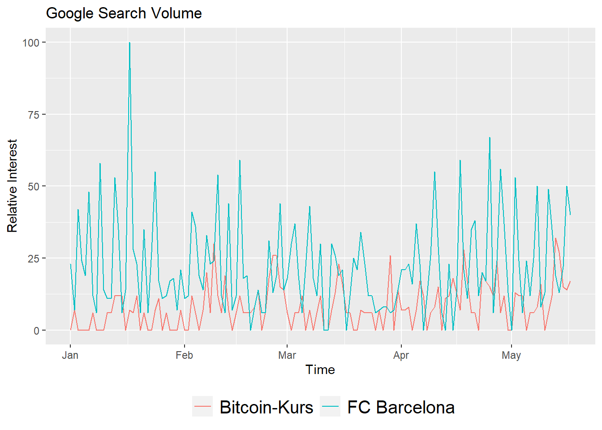

# 4.	Збір та читання інформації з різноманітних джерел: файли, веб-сторінки, бази R {#chapter4}

---

Автори: Савчук Сергій, Юрій Клебан

---

## План {-}

- [Загальний опис структури даних](#chapter41)
- [Опис набору даних `TelecomUsers`](#chapter42)
<!-- - [Імпорт даних засобами RStudio](#chapter43) -->
- [CSV: поняття, читання та запис](#chapter43)
- [Excel (xlsx): поняття, читання та запис](#chapter44)
- [XML: поняття, читання та запис](#chapter45)
- [JSON and API: поняття, читання] (#chapter46)
- [Google Services](#chapter46)
  - [Spreadsheets](#chapter461)
  - [Trends](#chapter461)
- [SQL (SQLite sample)](#chapter47)

---

## Загальний опис структури даних {#chapter41}

<div class="alert alert-danger">
<i class="fa-2x fas fa-alert fa-battery-quarter"></i>
Матеріали розділу у процесі підготовки.
</div>

Усі дані, що використовуються для наукових досліджень можна розділити на 3 блоки:

- [x] Структуровані
- [x] Слабоструктуровані
- [x] Неструктуровані

**Структуровані дані** зазвичай зрозумілі для користувача, сформовані відповідно до певних вимог та дозволяють швидко їх вивчити, без додаткових процедур підготовки.

Важливою для нас характеристикою **структурованих даних** є те, що вони досить просто піддаються машинній обробці, аналізу та візуалізації.

**Слабоструктуровані дані** часто можуть бути сприйняті людиною, проте форма їх подачі не дозволяє швидко проаналізувати її машиною.

Найпростішим прикладом структурованих даних є табличні дані, наприклад, в Microsoft Excel, де кожен рядок - це одне спостереження, а кожен стовпець - це одна характеристика.

Слабоструктуровані дані можуть бути перетворені до структурованих за допомогою підготовлених спеціалістом з по роботі з дадними алгоритмом. Подібний етап зазвчай потребує детального аналізу полів, форми по дання, визначення шаблонів помилок у даних тощо.

**Неструктуровані дані**

## Опис набору даних `Telecom Users` {#chapter42}

<div class="alert alert-info">
Опис інформації про набір даних взято з сервісу [`kaggle.com`](https://kaggle.com).<br>
Оригінальний набір розміщений за адресою [`https://www.kaggle.com/radmirzosimov/telecom-users-dataset`](https://www.kaggle.com/radmirzosimov/telecom-users-dataset).
</div>

**Призначення**:

Описаний датасет призначений для практикування спеціалістами з машинного навчання розв'язування задач класифікації.

**Опис:**

Any business wants to maximize the number of customers. To achieve this goal, it is important not only to try to attract new ones, but also to retain existing ones. Retaining a client will cost the company less than attracting a new one. In addition, a new client may be weakly interested in business services and it will be difficult to work with him, while old clients already have the necessary data on interaction with the service.

Accordingly, predicting the churn, we can react in time and try to keep the client who wants to leave. Based on the data about the services that the client uses, we can make him a special offer, trying to change his decision to leave the operator. This will make the task of retention easier to implement than the task of attracting new users, about which we do not know anything yet.

You are provided with a dataset from a telecommunications company. The data contains information about almost six thousand users, their demographic characteristics, the services they use, the duration of using the operator's services, the method of payment, and the amount of payment.

The task is to analyze the data and predict the churn of users (to identify people who will and will not renew their contract). The work should include the following mandatory items:

1. Description of the data (with the calculation of basic statistics);
2. Research of dependencies and formulation of hypotheses;
3. Building models for predicting the outflow (with justification for the choice of a particular model) 4. based on tested hypotheses and identified relationships;
5. Comparison of the quality of the obtained models.

**Опис полів набору даних:**

- [x] `customerID` - customer id
- [x] `gender` - client gender (male / female)
- [x] `SeniorCitizen` - is the client retired (1, 0)
- [x] `Partner` - is the client married (Yes, No)
- [x] `tenure` - how many months a person has been a client of the company
- [x] `PhoneService` - is the telephone service connected (Yes, No)
- [x] `MultipleLines` - are multiple phone lines connected (Yes, No, No phone service)
- [x] `InternetService` - client's Internet service provider (DSL, Fiber optic, No)
- [x] `OnlineSecurity` - is the online security service connected (Yes, No, No internet service)
- [x] `OnlineBackup` - is the online backup service activated (Yes, No, No internet service)
- [x] `DeviceProtection` - does the client have equipment insurance (Yes, No, No internet service)
- [x] `TechSupport` - is the technical support service connected (Yes, No, No internet service)
- [x] `StreamingTV` - is the streaming TV service connected (Yes, No, No internet service)
- [x] `StreamingMovies` - is the streaming cinema service activated (Yes, No, No internet service)
- [x] `Contract` - type of customer contract (Month-to-month, One year, Two year)
- [x] `PaperlessBilling` - whether the client uses paperless billing (Yes, No)
- [x] `PaymentMethod` - payment method (Electronic check, Mailed check, Bank transfer (automatic), Credit card (automatic))
- [x] `MonthlyCharges` - current monthly payment
- [x] `TotalCharges` - the total amount that the client paid for the services for the entire time
- [x] `Churn - whether` there was a churn (Yes or No)

## Імпорт даних засобами RStudio {#chapter321}

`RStudio` має ряд засобів для

## CSV-файли: читання, запис {#chapter43}

**CSV** - це тип файлів, у якому інформація розділена комами (`Comma Separated Values`). CSV є досить зручним форматом даних для передачі між різними машинами, адже по суті є текстовим файлом і дозволяє легко його зчитати.

_Примітка. Наспрвді кома не завжди є роздільником CSV-файлів. Це можуть бути і інші символи._


```r
# lets check current working directory to write correct files path
getwd()
```

```
## [1] "E:/Repos/YuRa/r-science-dev"
```

You can use / or \\ for writing correct path in R. For example:

```
path = "d:/projects/file.csv"
path = "d:\\projects\\file.csv"
```

To combine path use paste() or paste0() functions


```r
work_dir = getwd()
work_dir 
```

```
## [1] "E:/Repos/YuRa/r-science-dev"
```


```r
file_name = "temp_file.csv"
file_path = paste0(work_dir, "/", file_name)
file_path
```

```
## [1] "E:/Repos/YuRa/r-science-dev/temp_file.csv"
```


```r
file_path = paste(work_dir, file_name, sep = "/")
file_path
```

```
## [1] "E:/Repos/YuRa/r-science-dev/temp_file.csv"
```

Thare are few methods for reading/writing csv in `base` package:

- [x] `read.csv()`, `write.csv` - default data separator is `,`, decimal is separator `.`.
- [x] `read.csv2()`, `write.csv2` - default data separator is `;`, decimal is separator `,`.

Before using any new function check it usage information with `help(function_name)` or `?function_name`,` example: `?read.csv`.

You can read (current data set has NA values as example, there are no NA in original datase):


```r
data <- read.csv2("data/telecom_users.csv") # default reading
```


```r
data <- read.csv2("data/telecom_users.csv",
                  sep = ",", # comma not only possibel separator
                  dec = ".", # decimal separator can be different
                  na.strings = c("", "NA", "NULL")) # you can define NA values
```


```r
str(data) # chack data structure / types/ values
```

```
## 'data.frame':	5986 obs. of  22 variables:
##  $ X               : int  1869 4528 6344 6739 432 2215 5260 6001 1480 5137 ...
##  $ customerID      : chr  "7010-BRBUU" "9688-YGXVR" "9286-DOJGF" "6994-KERXL" ...
##  $ gender          : chr  "Male" "Female" "Female" "Male" ...
##  $ SeniorCitizen   : int  0 0 1 0 0 0 0 0 0 1 ...
##  $ Partner         : chr  "Yes" "No" "Yes" "No" ...
##  $ Dependents      : chr  "Yes" "No" "No" "No" ...
##  $ tenure          : int  72 44 38 4 2 70 33 1 39 55 ...
##  $ PhoneService    : chr  "Yes" "Yes" "Yes" "Yes" ...
##  $ MultipleLines   : chr  "Yes" "No" "Yes" "No" ...
##  $ InternetService : chr  "No" "Fiber optic" "Fiber optic" "DSL" ...
##  $ OnlineSecurity  : chr  "No internet service" "No" "No" "No" ...
##  $ OnlineBackup    : chr  "No internet service" "Yes" "No" "No" ...
##  $ DeviceProtection: chr  "No internet service" "Yes" "No" "No" ...
##  $ TechSupport     : chr  "No internet service" "No" "No" "No" ...
##  $ StreamingTV     : chr  "No internet service" "Yes" "No" "No" ...
##  $ StreamingMovies : chr  "No internet service" "No" "No" "Yes" ...
##  $ Contract        : chr  "Two year" "Month-to-month" "Month-to-month" "Month-to-month" ...
##  $ PaperlessBilling: chr  "No" "Yes" "Yes" "Yes" ...
##  $ PaymentMethod   : chr  "Credit card (automatic)" "Credit card (automatic)" "Bank transfer (automatic)" "Electronic check" ...
##  $ MonthlyCharges  : num  24.1 88.2 75 55.9 53.5 ...
##  $ TotalCharges    : num  1735 3973 2870 238 120 ...
##  $ Churn           : chr  "No" "No" "Yes" "No" ...
```


```r
head(data) # top 6 rows, use n = X, for viewing top X lines
```

```
##      X customerID gender SeniorCitizen Partner Dependents tenure PhoneService
## 1 1869 7010-BRBUU   Male             0     Yes        Yes     72          Yes
## 2 4528 9688-YGXVR Female             0      No         No     44          Yes
## 3 6344 9286-DOJGF Female             1     Yes         No     38          Yes
## 4 6739 6994-KERXL   Male             0      No         No      4          Yes
## 5  432 2181-UAESM   Male             0      No         No      2          Yes
## 6 2215 4312-GVYNH Female             0     Yes         No     70           No
##      MultipleLines InternetService      OnlineSecurity        OnlineBackup
## 1              Yes              No No internet service No internet service
## 2               No     Fiber optic                  No                 Yes
## 3              Yes     Fiber optic                  No                  No
## 4               No             DSL                  No                  No
## 5               No             DSL                 Yes                  No
## 6 No phone service             DSL                 Yes                  No
##      DeviceProtection         TechSupport         StreamingTV
## 1 No internet service No internet service No internet service
## 2                 Yes                  No                 Yes
## 3                  No                  No                  No
## 4                  No                  No                  No
## 5                 Yes                  No                  No
## 6                 Yes                 Yes                  No
##       StreamingMovies       Contract PaperlessBilling             PaymentMethod
## 1 No internet service       Two year               No   Credit card (automatic)
## 2                  No Month-to-month              Yes   Credit card (automatic)
## 3                  No Month-to-month              Yes Bank transfer (automatic)
## 4                 Yes Month-to-month              Yes          Electronic check
## 5                  No Month-to-month               No          Electronic check
## 6                 Yes       Two year              Yes Bank transfer (automatic)
##   MonthlyCharges TotalCharges Churn
## 1          24.10      1734.65    No
## 2          88.15      3973.20    No
## 3          74.95      2869.85   Yes
## 4          55.90       238.50    No
## 5          53.45       119.50    No
## 6          49.85      3370.20    No
```


```r
is.data.frame(data) # if data is data.frame
```

```
## [1] TRUE
```

```r
any(is.na(data)) # if dataframe contains any NA values
```

```
## [1] TRUE
```

```r
apply(is.na(data), 2, any) #check NA by 2nd dimension - columns
```

```
##                X       customerID           gender    SeniorCitizen 
##            FALSE            FALSE            FALSE            FALSE 
##          Partner       Dependents           tenure     PhoneService 
##            FALSE            FALSE            FALSE            FALSE 
##    MultipleLines  InternetService   OnlineSecurity     OnlineBackup 
##            FALSE            FALSE            FALSE            FALSE 
## DeviceProtection      TechSupport      StreamingTV  StreamingMovies 
##            FALSE            FALSE            FALSE            FALSE 
##         Contract PaperlessBilling    PaymentMethod   MonthlyCharges 
##            FALSE            FALSE            FALSE             TRUE 
##     TotalCharges            Churn 
##             TRUE            FALSE
```

Check `MonthlyCharges: TRUE` and `TotalCharges: TRUE`. These columns has NA-values.

Let's replace them with `mean`: 


```r
data[is.na(data$TotalCharges), "TotalCharges"] <- mean(data$TotalCharges, na.rm = T)
data[is.na(data$MonthlyCharges), "MonthlyCharges"] <- mean(data$MonthlyCharges, na.rm = T)
any(is.na(data)) # check for NA
```

```
## [1] FALSE
```

You can write data with `write.csv()`, `write.csv2()` from `base` package.


```r
write.csv(data, file = "data/cleaned_data.csv", row.names = F)
# by default row.names = TRUE and file will contains first columns with row numbers 1,2, ..., N
```

One more useful package is `readr`. Examples of using:

```
#install.packages(“readr”)
library(readr)
data <- read_csv(file = "data/telecom_users.csv", … )
data <- read_csv2(file = "data/telecom_users.csv", … )
```

---

## Excel (xlsx): читання, запис {#chapter44}

There are many packages to read/write MS Excel files. `xlsx` one of the most useful.


```r
#install.packages("xlsx") install before use it
library(xlsx)
```


```r
any(grepl("xlsx", installed.packages())) # check if package installed
```

```
## [1] TRUE
```

**`?read.xlsx`** - review package functions and params

Let's read the data `telecom_users.xlsx`: 


```r
data <- read.xlsx("data/telecom_users.xlsx", sheetIndex = 1)
# sheetIndex = 1 - select sheet to read, or use sheetName = "sheet1" to read by Name
```


```r
# You can also use startRow, endRow and other params to define how mutch data read
data <- read.xlsx("data/telecom_users.xlsx", sheetIndex = 1, endRow = 100)
```

Let's replace `Churn` values `Yes`/`No` by `1`/`0`: 


```r
head(data$Churn)
```

```
## [1] "No"  "No"  "Yes" "No"  "No"  "No"
```


```r
data$Churn <- ifelse(data$Churn == "Yes", 1, 0)
```


```r
head(data$Churn)
```

```
## [1] 0 0 1 0 0 0
```

Write final data to csv:


```r
write.xlsx(data, file = "data/final_telecom_data.xlsx")
```

### Task 2.1 {#chapter441}

Download from kaggle.com and read dataset `Default_Fin.csv`: 
https://www.kaggle.com/kmldas/loan-default-prediction

_Description:_

This is a synthetic dataset created using actual data from a financial institution. The data has been modified to remove identifiable features and the numbers transformed to ensure they do not link to original source (financial institution).

This is intended to be used for academic purposes for beginners who want to practice financial analytics from a simple financial dataset.

- [x] `Index` - This is the serial number or unique identifier of the loan taker
- [x] `Employed`     - This is a Boolean 1= employed 0= unemployed 
- [x] `Bank.Balance` - Bank Balance of the loan taker
- [x] `Annual.Salary` - Annual salary of the loan taker  
- [x] `Defaulted` - This is a Boolean 1= defaulted 0= not defaulted

1. Check what columns has missing values
2. Count default and non-default clients / and parts of total clients in %
3. Count Employed clients
4. Count Employed Default clients
5. Average salary by Employed clients
6. Rename columns to "id", "empl", "balance", "salary", "default"

---

### Solution for Task 2.1 {#chapter442}


```r
data <- read.csv("data/Default_Fin.csv")
head(data)
```

```
##   Index Employed Bank.Balance Annual.Salary Defaulted.
## 1     1        1      8754.36     532339.56          0
## 2     2        0      9806.16     145273.56          0
## 3     3        1     12882.60     381205.68          0
## 4     4        1      6351.00     428453.88          0
## 5     5        1      9427.92     461562.00          0
## 6     6        0     11035.08      89898.72          0
```

> 1. Check what columns has missing values


```r
any(is.na(data))
```

```
## [1] FALSE
```

> 2. Count default and non-default clients / and parts of total clients in %


```r
def_count <- nrow(data[data$Defaulted. == 1, ])
no_def_count <- nrow(data[data$Defaulted. == 0, ])
def_count
```

```
## [1] 333
```

```r
no_def_count 
```

```
## [1] 9667
```


```r
def_count / nrow(data) * 100 # part defaults
```

```
## [1] 3.33
```

```r
no_def_count / nrow(data) * 100 # part non-defaults
```

```
## [1] 96.67
```

> 3. Count Employed clients


```r
empl <- data[data$Employed == 1, ]
nrow(empl)
```

```
## [1] 7056
```


> 4. Count Employed Default clients


```r
empl <- data[data$Employed == 1 & data$Defaulted. == 1, ]
nrow(empl)
```

```
## [1] 206
```


> 5. Average salary by Employed clients


```r
empl <- data[data$Employed == 1, ]
mean(empl$Annual.Salary)
```

```
## [1] 480143.4
```

> 6. Rename columns to "id", "empl", "balance", "salary", "default":


```r
colnames(data) <- c("id", "empl", "balance", "salary", "default")
head(data)
```

```
##   id empl  balance    salary default
## 1  1    1  8754.36 532339.56       0
## 2  2    0  9806.16 145273.56       0
## 3  3    1 12882.60 381205.68       0
## 4  4    1  6351.00 428453.88       0
## 5  5    1  9427.92 461562.00       0
## 6  6    0 11035.08  89898.72       0
```

---

## XML: читання, запис {#chapter45}

`XML` - eXtensible Markup Language.

For our example we will use data from `data/employes.xml`. File contains records with info:

```
<RECORDS>
   <EMPLOYEE>
      <ID>1</ID>
      <NAME>Rick</NAME>
      <SALARY>623.3</SALARY>
      <STARTDATE>1/1/2012</STARTDATE>
      <DEPT>IT</DEPT>
   </EMPLOYEE>
   ...
</RECORDS>
```


```r
#install.packages("XML")
library("XML")
#install.packages("methods")
library("methods")
```


```r
result <- xmlParse(file = "data/employes.xml")
print(result)
```

```
## <?xml version="1.0"?>
## <RECORDS>
##   <EMPLOYEE>
##     <ID>1</ID>
##     <NAME>Rick</NAME>
##     <SALARY>623.3</SALARY>
##     <STARTDATE>1/1/2012</STARTDATE>
##     <DEPT>IT</DEPT>
##   </EMPLOYEE>
##   <EMPLOYEE>
##     <ID>2</ID>
##     <NAME>Dan</NAME>
##     <SALARY>515.2</SALARY>
##     <STARTDATE>9/23/2013</STARTDATE>
##     <DEPT>Operations</DEPT>
##   </EMPLOYEE>
##   <EMPLOYEE>
##     <ID>3</ID>
##     <NAME>Michelle</NAME>
##     <SALARY>611</SALARY>
##     <STARTDATE>11/15/2014</STARTDATE>
##     <DEPT>IT</DEPT>
##   </EMPLOYEE>
##   <EMPLOYEE>
##     <ID>4</ID>
##     <NAME>Ryan</NAME>
##     <SALARY>729</SALARY>
##     <STARTDATE>5/11/2014</STARTDATE>
##     <DEPT>HR</DEPT>
##   </EMPLOYEE>
##   <EMPLOYEE>
##     <ID>5</ID>
##     <NAME>Gary</NAME>
##     <SALARY>843.25</SALARY>
##     <STARTDATE>3/27/2015</STARTDATE>
##     <DEPT>Finance</DEPT>
##   </EMPLOYEE>
##   <EMPLOYEE>
##     <ID>6</ID>
##     <NAME>Nina</NAME>
##     <SALARY>578</SALARY>
##     <STARTDATE>5/21/2013</STARTDATE>
##     <DEPT>IT</DEPT>
##   </EMPLOYEE>
##   <EMPLOYEE>
##     <ID>7</ID>
##     <NAME>Simon</NAME>
##     <SALARY>632.8</SALARY>
##     <STARTDATE>7/30/2013</STARTDATE>
##     <DEPT>Operations</DEPT>
##   </EMPLOYEE>
##   <EMPLOYEE>
##     <ID>8</ID>
##     <NAME>Guru</NAME>
##     <SALARY>722.5</SALARY>
##     <STARTDATE>6/17/2014</STARTDATE>
##     <DEPT>Finance</DEPT>
##   </EMPLOYEE>
## </RECORDS>
## 
```


```r
rootnode <- xmlRoot(result) # reading rootnode of xml document
rootnode[[1]] # reading first record
```

```
## <EMPLOYEE>
##   <ID>1</ID>
##   <NAME>Rick</NAME>
##   <SALARY>623.3</SALARY>
##   <STARTDATE>1/1/2012</STARTDATE>
##   <DEPT>IT</DEPT>
## </EMPLOYEE>
```


```r
rootnode[[1]][[2]] # reading first record in root node and second tag, its <NAME>
```

```
## <NAME>Rick</NAME>
```


```r
xmldataframe <- xmlToDataFrame("data/employes.xml")
xmldataframe
```

```
##   ID     NAME SALARY  STARTDATE       DEPT
## 1  1     Rick  623.3   1/1/2012         IT
## 2  2      Dan  515.2  9/23/2013 Operations
## 3  3 Michelle    611 11/15/2014         IT
## 4  4     Ryan    729  5/11/2014         HR
## 5  5     Gary 843.25  3/27/2015    Finance
## 6  6     Nina    578  5/21/2013         IT
## 7  7    Simon  632.8  7/30/2013 Operations
## 8  8     Guru  722.5  6/17/2014    Finance
```


## JSON and API {#chapter46}


`JSON` (`JavaScript Object Notation`) is a lightweight data-interchange format. It is easy for humans to read and write. It is easy for machines to parse and generate. It is based on a subset of the JavaScript Programming Language Standard.

`API` is the acronym for `Application Programming Interface`, which is a software intermediary that allows two applications to talk to each other. 

One of the most popular packages for `json` is `jsonlite`.


```r
#install.packages("jsonlite")
library(jsonlite)
```

Let's use readinginformation about BTC and USDT crypro currencies from Binance


```r
market = 'BTCUSDT'
interval = '1h'
limit = 100

url <- paste0(url = "https://api.binance.com/api/v3/klines?symbol=", market ,"&interval=", interval,"&limit=", limit)
print(url) # complete request URL
```

```
## [1] "https://api.binance.com/api/v3/klines?symbol=BTCUSDT&interval=1h&limit=100"
```

On the nex stage you need use `fromJSON()` function to get data.

More details about requests to Binanace at https://github.com/binance/binance-spot-api-docs/blob/master/rest-api.md#klinecandlestick-data

If you enter `url` value at browser response is going to be like this:

```json
[
  [
    1499040000000,      // Open time
    "0.01634790",       // Open
    "0.80000000",       // High
    "0.01575800",       // Low
    "0.01577100",       // Close
    "148976.11427815",  // Volume
    1499644799999,      // Close time
    "2434.19055334",    // Quote asset volume
    308,                // Number of trades
    "1756.87402397",    // Taker buy base asset volume
    "28.46694368",      // Taker buy quote asset volume
    "17928899.62484339" // Ignore.
  ]
]
```


```r
data <- fromJSON(url) # get json and transform it to list()
data <- data[, 1:7] # let's left only 1:7 columns (from Open time to Close time)
head(data)
```

```
##      [,1]            [,2]             [,3]             [,4]            
## [1,] "1.625724e+12"  "32880.97000000" "33512.53000000" "32857.09000000"
## [2,] "1625727600000" "33096.85000000" "33260.80000000" "32242.07000000"
## [3,] "1625731200000" "32487.56000000" "32618.25000000" "32231.92000000"
## [4,] "1625734800000" "32570.54000000" "32700.00000000" "32425.20000000"
## [5,] "1625738400000" "32570.12000000" "32748.88000000" "32447.32000000"
## [6,] "1.625742e+12"  "32486.43000000" "32744.89000000" "32077.00000000"
##      [,5]             [,6]            [,7]           
## [1,] "33096.72000000" "3536.85699100" "1625727599999"
## [2,] "32487.57000000" "7911.85857500" "1625731199999"
## [3,] "32570.53000000" "4128.84416800" "1625734799999"
## [4,] "32570.13000000" "2719.29978200" "1625738399999"
## [5,] "32486.42000000" "2354.44869800" "1625741999999"
## [6,] "32696.44000000" "5820.07833200" "1625745599999"
```


```r
typeof(data) # check data type
```

```
## [1] "character"
```

```r
data <- as.data.frame(data) # convert to dataframe
head(data)
```

```
##              V1             V2             V3             V4             V5
## 1  1.625724e+12 32880.97000000 33512.53000000 32857.09000000 33096.72000000
## 2 1625727600000 33096.85000000 33260.80000000 32242.07000000 32487.57000000
## 3 1625731200000 32487.56000000 32618.25000000 32231.92000000 32570.53000000
## 4 1625734800000 32570.54000000 32700.00000000 32425.20000000 32570.13000000
## 5 1625738400000 32570.12000000 32748.88000000 32447.32000000 32486.42000000
## 6  1.625742e+12 32486.43000000 32744.89000000 32077.00000000 32696.44000000
##              V6            V7
## 1 3536.85699100 1625727599999
## 2 7911.85857500 1625731199999
## 3 4128.84416800 1625734799999
## 4 2719.29978200 1625738399999
## 5 2354.44869800 1625741999999
## 6 5820.07833200 1625745599999
```


```r
# fix columns names
colnames(data) <- c("Open_time", "Open", "High", "Low", "Close", "Volume", "Close_time")
head(data) # looks better, but columns are characters still
```

```
##       Open_time           Open           High            Low          Close
## 1  1.625724e+12 32880.97000000 33512.53000000 32857.09000000 33096.72000000
## 2 1625727600000 33096.85000000 33260.80000000 32242.07000000 32487.57000000
## 3 1625731200000 32487.56000000 32618.25000000 32231.92000000 32570.53000000
## 4 1625734800000 32570.54000000 32700.00000000 32425.20000000 32570.13000000
## 5 1625738400000 32570.12000000 32748.88000000 32447.32000000 32486.42000000
## 6  1.625742e+12 32486.43000000 32744.89000000 32077.00000000 32696.44000000
##          Volume    Close_time
## 1 3536.85699100 1625727599999
## 2 7911.85857500 1625731199999
## 3 4128.84416800 1625734799999
## 4 2719.29978200 1625738399999
## 5 2354.44869800 1625741999999
## 6 5820.07833200 1625745599999
```


```r
is.numeric(data[,1]) # check 1st column type is numeric
```

```
## [1] FALSE
```

```r
is.numeric(data[,2]) # check 2nd column type is numeric
```

```
## [1] FALSE
```


```r
data <- as.data.frame(sapply(data, as.numeric)) # convert all columns to numeric
head(data) # good, its double now
```

```
##      Open_time     Open     High      Low    Close   Volume   Close_time
## 1 1.625724e+12 32880.97 33512.53 32857.09 33096.72 3536.857 1.625728e+12
## 2 1.625728e+12 33096.85 33260.80 32242.07 32487.57 7911.859 1.625731e+12
## 3 1.625731e+12 32487.56 32618.25 32231.92 32570.53 4128.844 1.625735e+12
## 4 1.625735e+12 32570.54 32700.00 32425.20 32570.13 2719.300 1.625738e+12
## 5 1.625738e+12 32570.12 32748.88 32447.32 32486.42 2354.449 1.625742e+12
## 6 1.625742e+12 32486.43 32744.89 32077.00 32696.44 5820.078 1.625746e+12
```

Final stage is to convert `Open_time` and `Close_time` to dates.


```r
data$Open_time <- as.POSIXct(data$Open_time/1e3, origin = '1970-01-01')
data$Close_time <- as.POSIXct(data$Close_time/1e3, origin = '1970-01-01')

head(data) 
```

```
##             Open_time     Open     High      Low    Close   Volume
## 1 2021-07-08 09:00:00 32880.97 33512.53 32857.09 33096.72 3536.857
## 2 2021-07-08 10:00:00 33096.85 33260.80 32242.07 32487.57 7911.859
## 3 2021-07-08 11:00:00 32487.56 32618.25 32231.92 32570.53 4128.844
## 4 2021-07-08 12:00:00 32570.54 32700.00 32425.20 32570.13 2719.300
## 5 2021-07-08 13:00:00 32570.12 32748.88 32447.32 32486.42 2354.449
## 6 2021-07-08 14:00:00 32486.43 32744.89 32077.00 32696.44 5820.078
##            Close_time
## 1 2021-07-08 09:59:59
## 2 2021-07-08 10:59:59
## 3 2021-07-08 11:59:59
## 4 2021-07-08 12:59:59
## 5 2021-07-08 13:59:59
## 6 2021-07-08 14:59:59
```


```r
tail(data) # check last records
```

```
##               Open_time     Open     High      Low    Close    Volume
## 95  2021-07-12 07:00:00 34447.92 34678.43 34290.00 34299.94 2014.2629
## 96  2021-07-12 08:00:00 34299.93 34340.96 34160.39 34330.25 1480.5921
## 97  2021-07-12 09:00:00 34328.70 34455.00 34207.95 34380.01 1217.8115
## 98  2021-07-12 10:00:00 34380.00 34510.00 34213.55 34281.74 1930.3338
## 99  2021-07-12 11:00:00 34281.74 34488.27 34213.16 34273.62 1703.5208
## 100 2021-07-12 12:00:00 34273.62 34334.27 34233.92 34298.09  144.8281
##              Close_time
## 95  2021-07-12 07:59:59
## 96  2021-07-12 08:59:59
## 97  2021-07-12 09:59:59
## 98  2021-07-12 10:59:59
## 99  2021-07-12 11:59:59
## 100 2021-07-12 12:59:59
```

---

## Google Services {#chapter46}

### Spreadsheets {#chapter461}

<div class="alert alert-info">
> THIS CHAPTER IS UNDER CONSTRUCTION / Working with Google Spreadsheets need account authorization.
</div>

`googlesheets4` is a package to work with Google Sheets from R. 


```r
#install.packages("googlesheets4")
library(googlesheets4)
```

You can read google documents after authentification on google service. There is sample code:

```
read_sheet("https://docs.google.com/spreadsheets/d/1U6Cf_qEOhiR9AZqTqS3mbMF3zt2db48ZP5v3rkrAEJY/edit#gid=780868077")
gs4_deauth()
```

Let's read sample dataset `gapminder`. It detailed described in next paragraph.

gs4_example("gapminder")

---

### Trends {#chapter462}

**`Google Trends`** is a service for analyzing search requests by many filters like `region` (continent, country, locality), `period` (year, month), `information category` (business, education, hobby, healthcare), `information type` (news, shopping, video, images) https://trends.google.com/trends/


```r
#install.packages('gtrendsR')
#install.packages('ggplot2')
library(gtrendsR) # loading package for Google Trends queries
library(ggplot2)
```

Let's configure out google trends query params


```r
keywords = c("Bitcoin-Kurs", "FC Barcelona") # search keywords
country = c('AT') # search region from https://support.google.com/business/answer/6270107?hl=en
time = ("2021-01-01 2021-05-17") # period
channel = 'web' # search channel: google search ('news' - google news, 'images' - google images)
```


```r
# query
trends = gtrends(keywords, gprop = channel, geo = country, time = time, tz = "UTC")
```


```r
time_trend = trends$interest_over_time
head(time_trend) # last 6
```

```
##         date hits      keyword geo                  time gprop category
## 1 2021-01-01    0 Bitcoin-Kurs  AT 2021-01-01 2021-05-17   web        0
## 2 2021-01-02    0 Bitcoin-Kurs  AT 2021-01-01 2021-05-17   web        0
## 3 2021-01-03    0 Bitcoin-Kurs  AT 2021-01-01 2021-05-17   web        0
## 4 2021-01-04    0 Bitcoin-Kurs  AT 2021-01-01 2021-05-17   web        0
## 5 2021-01-05    0 Bitcoin-Kurs  AT 2021-01-01 2021-05-17   web        0
## 6 2021-01-06   12 Bitcoin-Kurs  AT 2021-01-01 2021-05-17   web        0
```


```r
tail(time_trend) # latest 6
```

```
##           date hits      keyword geo                  time gprop category
## 269 2021-05-12   16 FC Barcelona  AT 2021-01-01 2021-05-17   web        0
## 270 2021-05-13    6 FC Barcelona  AT 2021-01-01 2021-05-17   web        0
## 271 2021-05-14   12 FC Barcelona  AT 2021-01-01 2021-05-17   web        0
## 272 2021-05-15   41 FC Barcelona  AT 2021-01-01 2021-05-17   web        0
## 273 2021-05-16   58 FC Barcelona  AT 2021-01-01 2021-05-17   web        0
## 274 2021-05-17   26 FC Barcelona  AT 2021-01-01 2021-05-17   web        0
```

Let's visualize query results:


```r
plot <- ggplot(data=time_trend, aes(x=date, y=hits, group=keyword, col=keyword)) +
  geom_line() +
  xlab('Time') + 
  ylab('Relative Interest') + 
  theme(legend.title = element_blank(), legend.position="bottom", legend.text=element_text(size=15)) + 
  ggtitle("Google Search Volume")  

plot
```



---

## SQL (SQLite sample) {#chapter47}

We are going to review working with database on SQLite, becouse it allows us not to install DB-server and start working with simple file. 

For now we will use `RSQLite` package.


```r
#install.packages("RSQLite")
library(RSQLite)
```


```r
# let's use mtcars dataset
data("mtcars") # loads the data
head(mtcars) # preview the data
```

```
##                    mpg cyl disp  hp drat    wt  qsec vs am gear carb
## Mazda RX4         21.0   6  160 110 3.90 2.620 16.46  0  1    4    4
## Mazda RX4 Wag     21.0   6  160 110 3.90 2.875 17.02  0  1    4    4
## Datsun 710        22.8   4  108  93 3.85 2.320 18.61  1  1    4    1
## Hornet 4 Drive    21.4   6  258 110 3.08 3.215 19.44  1  0    3    1
## Hornet Sportabout 18.7   8  360 175 3.15 3.440 17.02  0  0    3    2
## Valiant           18.1   6  225 105 2.76 3.460 20.22  1  0    3    1
```


```r
# create new db file
db_path = paste0("data/cars_2.sqlite") # chage file name for new create connection
# create connection
conn <- dbConnect(RSQLite::SQLite(), 
                    db_path,
                    overwrite = TRUE, append = FALSE) # for lecture content only
```


```r
# Write the mtcars dataset into a table names mtcars_data
dbWriteTable(conn, "cars_table", mtcars)
# List all the tables available in the database
dbListTables(conn)
```

```
## [1] "cars_table"
```


```r
table_data <- dbGetQuery(conn, "SELECT * FROM cars_table")
head(table_data)
```

```
##    mpg cyl disp  hp drat    wt  qsec vs am gear carb
## 1 21.0   6  160 110 3.90 2.620 16.46  0  1    4    4
## 2 21.0   6  160 110 3.90 2.875 17.02  0  1    4    4
## 3 22.8   4  108  93 3.85 2.320 18.61  1  1    4    1
## 4 21.4   6  258 110 3.08 3.215 19.44  1  0    3    1
## 5 18.7   8  360 175 3.15 3.440 17.02  0  0    3    2
## 6 18.1   6  225 105 2.76 3.460 20.22  1  0    3    1
```


```r
# close connection
dbDisconnect(conn)
```

You can write complex queries for many tables if you knowledge of SQL allows.

## Web-pages (HTML)


