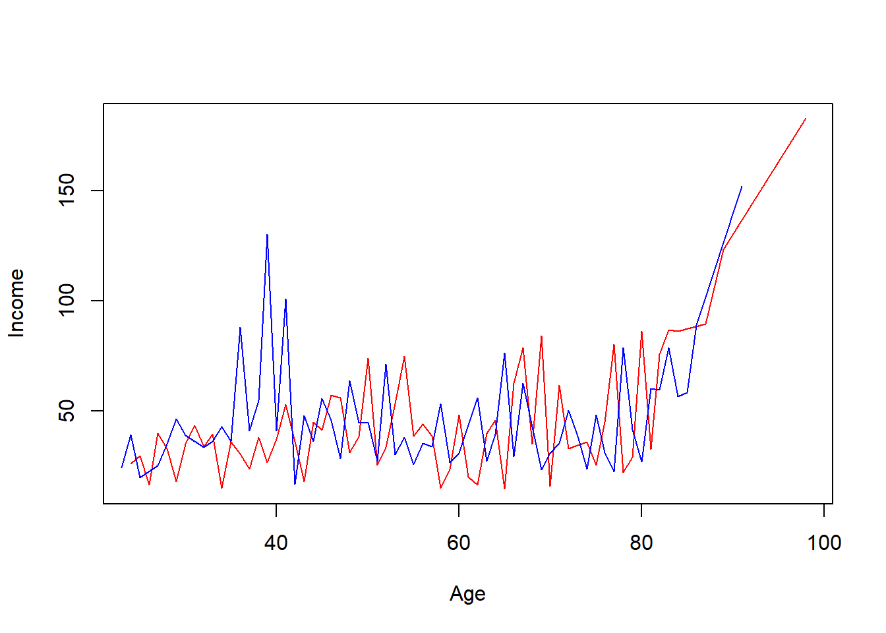

# Прийоми маніпулювання даними (з використанням можливостей бібліотеки dplyr) {#chapter5}

<div class="alert alert-danger">
<i class="far fa-bell fa-alert fa-2x"></i>
Матеріали курсу у процесі навповнення. Слідкуйте за оновленнями
</div>

---

Матеріали лекції у процесі перекладу, базовий контент розміщено у репозоторії https://github.com/kleban/r:

- [x] 032_ETL. Manipulate data with dplyr.ipynb
- [x] 033_ETL. Train Test Validation.ipynb
- [x] 034_ETL. Feature engineering in R.ipynb

---

## What's dplyr


The dplyr package is one of the most powerful and popular package in R for data manipulation.

Working with data:

- [x] Figure out what you want to do.
- [x] Describe those tasks in the form of a computer program.
- [x] Execute the program.

The dplyr package makes these steps fast and easy:

- [x] By constraining your options, it helps you think about your data manipulation challenges.
- [x] It provides simple verbs, functions that correspond to the most common data manipulation tasks, to help you translate your thoughts into code.
- [x] It uses efficient backends, so you spend less time waiting for the computer.

Before use you should install package:


```r
#install.packages("dplyr")
```

Next step is loading package:


```r
library(dplyr)
```

```
## 
## Attaching package: 'dplyr'
```

```
## The following objects are masked from 'package:stats':
## 
##     filter, lag
```

```
## The following objects are masked from 'package:base':
## 
##     intersect, setdiff, setequal, union
```


Alternative way is to load tidyverse package with other attached:


```r
#install.packages("tidyverse")
library(tidyverse)
```

```
## -- Attaching packages --------------------------------------- tidyverse 1.3.1 --
```

```
## v ggplot2 3.3.5     v purrr   0.3.4
## v tibble  3.1.2     v stringr 1.4.0
## v tidyr   1.1.3     v forcats 0.5.1
## v readr   1.4.0
```

```
## -- Conflicts ------------------------------------------ tidyverse_conflicts() --
## x dplyr::filter() masks stats::filter()
## x dplyr::lag()    masks stats::lag()
```

```r
# to tidyverse attached packages
# tidyverse_packages(include_self = TRUE)
```

---

## Exploring data with dplyr

### Funtions and dataset explore

For the next sample we are going to use `gapminder` dataset.

The gapminder data frame include six variables: `country`, `continent`, `year`, `lifeExp` -	life expectancy at birth, `pop` -	total population, `gdpPercap` -	per-capita GDP.

Per-capita GDP (Gross domestic product) is given in units of international dollars, a hypothetical unit of currency that has the same purchasing power parity that the U.S. dollar had in the United States at a given point in time – 2005, in this case.

The gapminder data frame is a special kind of data frame: a tibble.


```r
#install.packages("gapminder")
library(gapminder)  # load package and dataset
class(gapminder)
```

```
## [1] "tbl_df"     "tbl"        "data.frame"
```

Let's preview it with functions str(), glimpse(), head(), tail(), summary().


```r
str(gapminder)
```

```
## tibble [1,704 x 6] (S3: tbl_df/tbl/data.frame)
##  $ country  : Factor w/ 142 levels "Afghanistan",..: 1 1 1 1 1 1 1 1 1 1 ...
##  $ continent: Factor w/ 5 levels "Africa","Americas",..: 3 3 3 3 3 3 3 3 3 3 ...
##  $ year     : int [1:1704] 1952 1957 1962 1967 1972 1977 1982 1987 1992 1997 ...
##  $ lifeExp  : num [1:1704] 28.8 30.3 32 34 36.1 ...
##  $ pop      : int [1:1704] 8425333 9240934 10267083 11537966 13079460 14880372 12881816 13867957 16317921 22227415 ...
##  $ gdpPercap: num [1:1704] 779 821 853 836 740 ...
```


```r
glimpse(gapminder)
```

```
## Rows: 1,704
## Columns: 6
## $ country   <fct> "Afghanistan", "Afghanistan", "Afghanistan", "Afghanistan", ~
## $ continent <fct> Asia, Asia, Asia, Asia, Asia, Asia, Asia, Asia, Asia, Asia, ~
## $ year      <int> 1952, 1957, 1962, 1967, 1972, 1977, 1982, 1987, 1992, 1997, ~
## $ lifeExp   <dbl> 28.801, 30.332, 31.997, 34.020, 36.088, 38.438, 39.854, 40.8~
## $ pop       <int> 8425333, 9240934, 10267083, 11537966, 13079460, 14880372, 12~
## $ gdpPercap <dbl> 779.4453, 820.8530, 853.1007, 836.1971, 739.9811, 786.1134, ~
```


```r
head(gapminder) #shows first n-rows, 6 by default
```

```
## # A tibble: 6 x 6
##   country     continent  year lifeExp      pop gdpPercap
##   <fct>       <fct>     <int>   <dbl>    <int>     <dbl>
## 1 Afghanistan Asia       1952    28.8  8425333      779.
## 2 Afghanistan Asia       1957    30.3  9240934      821.
## 3 Afghanistan Asia       1962    32.0 10267083      853.
## 4 Afghanistan Asia       1967    34.0 11537966      836.
## 5 Afghanistan Asia       1972    36.1 13079460      740.
## 6 Afghanistan Asia       1977    38.4 14880372      786.
```


```r
tail(gapminder) #shows last n-rows, 6 by default
```

```
## # A tibble: 6 x 6
##   country  continent  year lifeExp      pop gdpPercap
##   <fct>    <fct>     <int>   <dbl>    <int>     <dbl>
## 1 Zimbabwe Africa     1982    60.4  7636524      789.
## 2 Zimbabwe Africa     1987    62.4  9216418      706.
## 3 Zimbabwe Africa     1992    60.4 10704340      693.
## 4 Zimbabwe Africa     1997    46.8 11404948      792.
## 5 Zimbabwe Africa     2002    40.0 11926563      672.
## 6 Zimbabwe Africa     2007    43.5 12311143      470.
```


```r
summary(gapminder)
```

```
##         country        continent        year         lifeExp     
##  Afghanistan:  12   Africa  :624   Min.   :1952   Min.   :23.60  
##  Albania    :  12   Americas:300   1st Qu.:1966   1st Qu.:48.20  
##  Algeria    :  12   Asia    :396   Median :1980   Median :60.71  
##  Angola     :  12   Europe  :360   Mean   :1980   Mean   :59.47  
##  Argentina  :  12   Oceania : 24   3rd Qu.:1993   3rd Qu.:70.85  
##  Australia  :  12                  Max.   :2007   Max.   :82.60  
##  (Other)    :1632                                                
##       pop              gdpPercap       
##  Min.   :6.001e+04   Min.   :   241.2  
##  1st Qu.:2.794e+06   1st Qu.:  1202.1  
##  Median :7.024e+06   Median :  3531.8  
##  Mean   :2.960e+07   Mean   :  7215.3  
##  3rd Qu.:1.959e+07   3rd Qu.:  9325.5  
##  Max.   :1.319e+09   Max.   :113523.1  
## 
```

### filter() function


```r
austria <- filter(gapminder, country == "Austria")
austria
```

```
## # A tibble: 12 x 6
##    country continent  year lifeExp     pop gdpPercap
##    <fct>   <fct>     <int>   <dbl>   <int>     <dbl>
##  1 Austria Europe     1952    66.8 6927772     6137.
##  2 Austria Europe     1957    67.5 6965860     8843.
##  3 Austria Europe     1962    69.5 7129864    10751.
##  4 Austria Europe     1967    70.1 7376998    12835.
##  5 Austria Europe     1972    70.6 7544201    16662.
##  6 Austria Europe     1977    72.2 7568430    19749.
##  7 Austria Europe     1982    73.2 7574613    21597.
##  8 Austria Europe     1987    74.9 7578903    23688.
##  9 Austria Europe     1992    76.0 7914969    27042.
## 10 Austria Europe     1997    77.5 8069876    29096.
## 11 Austria Europe     2002    79.0 8148312    32418.
## 12 Austria Europe     2007    79.8 8199783    36126.
```

filter() takes logical expressions and returns the rows for which all are TRUE.


```r
# task: select rows with lifeExp less than 31
filter(gapminder, lifeExp < 31)
```

```
## # A tibble: 6 x 6
##   country      continent  year lifeExp     pop gdpPercap
##   <fct>        <fct>     <int>   <dbl>   <int>     <dbl>
## 1 Afghanistan  Asia       1952    28.8 8425333      779.
## 2 Afghanistan  Asia       1957    30.3 9240934      821.
## 3 Angola       Africa     1952    30.0 4232095     3521.
## 4 Gambia       Africa     1952    30    284320      485.
## 5 Rwanda       Africa     1992    23.6 7290203      737.
## 6 Sierra Leone Africa     1952    30.3 2143249      880.
```


```r
# task: select Austria only and year after 1980
filter(gapminder, country == "Austria", year > 1980)
```

```
## # A tibble: 6 x 6
##   country continent  year lifeExp     pop gdpPercap
##   <fct>   <fct>     <int>   <dbl>   <int>     <dbl>
## 1 Austria Europe     1982    73.2 7574613    21597.
## 2 Austria Europe     1987    74.9 7578903    23688.
## 3 Austria Europe     1992    76.0 7914969    27042.
## 4 Austria Europe     1997    77.5 8069876    29096.
## 5 Austria Europe     2002    79.0 8148312    32418.
## 6 Austria Europe     2007    79.8 8199783    36126.
```


```r
# task: select Austria and Belgium
filter(gapminder, country %in% c("Austria", "Belgium"))
```

```
## # A tibble: 24 x 6
##    country continent  year lifeExp     pop gdpPercap
##    <fct>   <fct>     <int>   <dbl>   <int>     <dbl>
##  1 Austria Europe     1952    66.8 6927772     6137.
##  2 Austria Europe     1957    67.5 6965860     8843.
##  3 Austria Europe     1962    69.5 7129864    10751.
##  4 Austria Europe     1967    70.1 7376998    12835.
##  5 Austria Europe     1972    70.6 7544201    16662.
##  6 Austria Europe     1977    72.2 7568430    19749.
##  7 Austria Europe     1982    73.2 7574613    21597.
##  8 Austria Europe     1987    74.9 7578903    23688.
##  9 Austria Europe     1992    76.0 7914969    27042.
## 10 Austria Europe     1997    77.5 8069876    29096.
## # ... with 14 more rows
```

---

## Pipe (%>%) operator

`%>%` is pipe operator. The pipe operator takes the thing on the left-hand-side and pipes it into the function call on the right-hand-side – literally, drops it in as the first argument.

> In R version before 4.1.0 pipe %>% operator is not a language build-in and you should install magrittr package:


```r
#install.packages("magrittr") # for pipe %>% operator
library(magrittr)
```

```
## 
## Attaching package: 'magrittr'
```

```
## The following object is masked from 'package:purrr':
## 
##     set_names
```

```
## The following object is masked from 'package:tidyr':
## 
##     extract
```

head() function without pipe and top 4 items:


```r
head(gapminder, n = 4)
```

```
## # A tibble: 4 x 6
##   country     continent  year lifeExp      pop gdpPercap
##   <fct>       <fct>     <int>   <dbl>    <int>     <dbl>
## 1 Afghanistan Asia       1952    28.8  8425333      779.
## 2 Afghanistan Asia       1957    30.3  9240934      821.
## 3 Afghanistan Asia       1962    32.0 10267083      853.
## 4 Afghanistan Asia       1967    34.0 11537966      836.
```


head() function with pipe and top 4 items:


```r
gapminder %>% head(4)
```

```
## # A tibble: 4 x 6
##   country     continent  year lifeExp      pop gdpPercap
##   <fct>       <fct>     <int>   <dbl>    <int>     <dbl>
## 1 Afghanistan Asia       1952    28.8  8425333      779.
## 2 Afghanistan Asia       1957    30.3  9240934      821.
## 3 Afghanistan Asia       1962    32.0 10267083      853.
## 4 Afghanistan Asia       1967    34.0 11537966      836.
```

Output is the same. So, let's rewrire filtering for Austria with pipe:


```r
austria <- gapminder %>% filter(country == "Austria")
austria
```

```
## # A tibble: 12 x 6
##    country continent  year lifeExp     pop gdpPercap
##    <fct>   <fct>     <int>   <dbl>   <int>     <dbl>
##  1 Austria Europe     1952    66.8 6927772     6137.
##  2 Austria Europe     1957    67.5 6965860     8843.
##  3 Austria Europe     1962    69.5 7129864    10751.
##  4 Austria Europe     1967    70.1 7376998    12835.
##  5 Austria Europe     1972    70.6 7544201    16662.
##  6 Austria Europe     1977    72.2 7568430    19749.
##  7 Austria Europe     1982    73.2 7574613    21597.
##  8 Austria Europe     1987    74.9 7578903    23688.
##  9 Austria Europe     1992    76.0 7914969    27042.
## 10 Austria Europe     1997    77.5 8069876    29096.
## 11 Austria Europe     2002    79.0 8148312    32418.
## 12 Austria Europe     2007    79.8 8199783    36126.
```


```r
# add more conditions in filter
austria <- gapminder %>% filter(country == "Austria", year > 2000)
austria
```

```
## # A tibble: 2 x 6
##   country continent  year lifeExp     pop gdpPercap
##   <fct>   <fct>     <int>   <dbl>   <int>     <dbl>
## 1 Austria Europe     2002    79.0 8148312    32418.
## 2 Austria Europe     2007    79.8 8199783    36126.
```

---

### select() function

Use select() to subset the data on variables/columns by names or index. You also can define order of columns with select().


```r
gapminder %>% 
  select(year, country, pop) %>%
  slice(1: 10)
```

```
## # A tibble: 10 x 3
##     year country          pop
##    <int> <fct>          <int>
##  1  1952 Afghanistan  8425333
##  2  1957 Afghanistan  9240934
##  3  1962 Afghanistan 10267083
##  4  1967 Afghanistan 11537966
##  5  1972 Afghanistan 13079460
##  6  1977 Afghanistan 14880372
##  7  1982 Afghanistan 12881816
##  8  1987 Afghanistan 13867957
##  9  1992 Afghanistan 16317921
## 10  1997 Afghanistan 22227415
```

<!--Lets combine few functions with pipe (%>%): -->

Finally, lest extend our filtering:


```r
# compare dplyr syntax with base R call
gapminder[gapminder$country == "Austria", c("year", "pop", "lifeExp")]
```

```
## # A tibble: 12 x 3
##     year     pop lifeExp
##    <int>   <int>   <dbl>
##  1  1952 6927772    66.8
##  2  1957 6965860    67.5
##  3  1962 7129864    69.5
##  4  1967 7376998    70.1
##  5  1972 7544201    70.6
##  6  1977 7568430    72.2
##  7  1982 7574613    73.2
##  8  1987 7578903    74.9
##  9  1992 7914969    76.0
## 10  1997 8069876    77.5
## 11  2002 8148312    79.0
## 12  2007 8199783    79.8
```

```r
gapminder %>% 
filter(country == "Austria") %>%
select(year, pop, lifeExp)
```

```
## # A tibble: 12 x 3
##     year     pop lifeExp
##    <int>   <int>   <dbl>
##  1  1952 6927772    66.8
##  2  1957 6965860    67.5
##  3  1962 7129864    69.5
##  4  1967 7376998    70.1
##  5  1972 7544201    70.6
##  6  1977 7568430    72.2
##  7  1982 7574613    73.2
##  8  1987 7578903    74.9
##  9  1992 7914969    76.0
## 10  1997 8069876    77.5
## 11  2002 8148312    79.0
## 12  2007 8199783    79.8
```


You can remove some columns using minus(operator) and add few filter conditions:


```r
austria <- gapminder %>% 
                filter(country == "Austria", year > 2000) %>%
                select(-continent, -gdpPercap) %>%
                head()
austria
```

```
## # A tibble: 2 x 4
##   country  year lifeExp     pop
##   <fct>   <int>   <dbl>   <int>
## 1 Austria  2002    79.0 8148312
## 2 Austria  2007    79.8 8199783
```

You can insert different conditions about columns you need to select.


```r
gapminder %>%
    select(!where(is.numeric)) %>%  # its 1704 records, because of repeating some records
    slice(1:5)
```

```
## # A tibble: 5 x 2
##   country     continent
##   <fct>       <fct>    
## 1 Afghanistan Asia     
## 2 Afghanistan Asia     
## 3 Afghanistan Asia     
## 4 Afghanistan Asia     
## 5 Afghanistan Asia
```


Let's output all unique pairs continent -> country with distinct() function:


```r
gapminder %>%
    select(country) %>%
    distinct() # its 142 records now
```

```
## # A tibble: 142 x 1
##    country    
##    <fct>      
##  1 Afghanistan
##  2 Albania    
##  3 Algeria    
##  4 Angola     
##  5 Argentina  
##  6 Australia  
##  7 Austria    
##  8 Bahrain    
##  9 Bangladesh 
## 10 Belgium    
## # ... with 132 more rows
```

---
### Random sampling

The sample_n() function selects random rows from a data frame


```r
gapminder %>% sample_n(5)
```

```
## # A tibble: 5 x 6
##   country             continent  year lifeExp      pop gdpPercap
##   <fct>               <fct>     <int>   <dbl>    <int>     <dbl>
## 1 France              Europe     1972    72.4 51732000    16107.
## 2 Trinidad and Tobago Americas   1962    64.9   887498     4998.
## 3 Vietnam             Asia       1967    47.8 39463910      637.
## 4 Algeria             Africa     2007    72.3 33333216     6223.
## 5 Switzerland         Europe     1972    73.8  6401400    27195.
```


If you want make pseudo-random generation reprodusable use set.seed(). Seed is start point of random generation. Different seeds give different output.


```r
set.seed(2021) # example, seed = 2021
```

The sample_frac() function selects random fraction rows from a data frame. Let's select $1\%$ of data


```r
set.seed(2021) # output not changing, uncomment it 
gapminder %>% sample_frac(0.1)
```

```
## # A tibble: 170 x 6
##    country            continent  year lifeExp      pop gdpPercap
##    <fct>              <fct>     <int>   <dbl>    <int>     <dbl>
##  1 Libya              Africa     1962    47.8  1441863     6757.
##  2 Botswana           Africa     1997    52.6  1536536     8647.
##  3 Swaziland          Africa     1957    43.4   326741     1245.
##  4 Dominican Republic Americas   1997    70.0  7992357     3614.
##  5 Iraq               Asia       2002    57.0 24001816     4391.
##  6 Libya              Africa     1987    66.2  3799845    11771.
##  7 Montenegro         Europe     1967    67.2   501035     5908.
##  8 New Zealand        Oceania    1957    70.3  2229407    12247.
##  9 Bulgaria           Europe     2007    73.0  7322858    10681.
## 10 Malawi             Africa     1997    47.5 10419991      692.
## # ... with 160 more rows
```

---

### Subset rows using their positions with slice()


**Description**

- [x] slice() lets you index rows by their (integer) locations. It allows you to select, remove, and duplicate rows. It is accompanied by a number of helpers for common use cases:
- [x] slice_head() and slice_tail() select the first or last rows.
- [x] slice_sample() randomly selects rows.
- [x] slice_min() and slice_max() select rows with highest or lowest values of a variable.

If .data is a grouped_df, the operation will be performed on each group, so that (e.g.) slice_head(df, n = 5) will select the first five rows in each group.

**Samples**


```r
gapminder %>% slice(1) # top 1 row
```

```
## # A tibble: 1 x 6
##   country     continent  year lifeExp     pop gdpPercap
##   <fct>       <fct>     <int>   <dbl>   <int>     <dbl>
## 1 Afghanistan Asia       1952    28.8 8425333      779.
```


```r
gapminder %>% slice(1:6) # top n = 6
```

```
## # A tibble: 6 x 6
##   country     continent  year lifeExp      pop gdpPercap
##   <fct>       <fct>     <int>   <dbl>    <int>     <dbl>
## 1 Afghanistan Asia       1952    28.8  8425333      779.
## 2 Afghanistan Asia       1957    30.3  9240934      821.
## 3 Afghanistan Asia       1962    32.0 10267083      853.
## 4 Afghanistan Asia       1967    34.0 11537966      836.
## 5 Afghanistan Asia       1972    36.1 13079460      740.
## 6 Afghanistan Asia       1977    38.4 14880372      786.
```


```r
gapminder %>% slice_head(n = 6) # works like head()
```

```
## # A tibble: 6 x 6
##   country     continent  year lifeExp      pop gdpPercap
##   <fct>       <fct>     <int>   <dbl>    <int>     <dbl>
## 1 Afghanistan Asia       1952    28.8  8425333      779.
## 2 Afghanistan Asia       1957    30.3  9240934      821.
## 3 Afghanistan Asia       1962    32.0 10267083      853.
## 4 Afghanistan Asia       1967    34.0 11537966      836.
## 5 Afghanistan Asia       1972    36.1 13079460      740.
## 6 Afghanistan Asia       1977    38.4 14880372      786.
```


```r
gapminder %>% slice_tail(n = 5) # works like tail()
```

```
## # A tibble: 5 x 6
##   country  continent  year lifeExp      pop gdpPercap
##   <fct>    <fct>     <int>   <dbl>    <int>     <dbl>
## 1 Zimbabwe Africa     1987    62.4  9216418      706.
## 2 Zimbabwe Africa     1992    60.4 10704340      693.
## 3 Zimbabwe Africa     1997    46.8 11404948      792.
## 4 Zimbabwe Africa     2002    40.0 11926563      672.
## 5 Zimbabwe Africa     2007    43.5 12311143      470.
```

*You can drop some recods with negative indexes:*


```r
gapminder %>% slice(-c(1:3,5)) %>% # remove Afganistan years 1952, 1957, 1962 and 1972 
    head(6)
```

```
## # A tibble: 6 x 6
##   country     continent  year lifeExp      pop gdpPercap
##   <fct>       <fct>     <int>   <dbl>    <int>     <dbl>
## 1 Afghanistan Asia       1967    34.0 11537966      836.
## 2 Afghanistan Asia       1977    38.4 14880372      786.
## 3 Afghanistan Asia       1982    39.9 12881816      978.
## 4 Afghanistan Asia       1987    40.8 13867957      852.
## 5 Afghanistan Asia       1992    41.7 16317921      649.
## 6 Afghanistan Asia       1997    41.8 22227415      635.
```


```r
# Random rows selection with slice_sample()
gapminder %>% slice_sample(n = 5) #use set.seed() to fix random
```

```
## # A tibble: 5 x 6
##   country          continent  year lifeExp      pop gdpPercap
##   <fct>            <fct>     <int>   <dbl>    <int>     <dbl>
## 1 Cambodia         Asia       2002    56.8 12926707      896.
## 2 Poland           Europe     2002    74.7 38625976    12002.
## 3 Bulgaria         Europe     1972    70.9  8576200     6597.
## 4 Congo, Dem. Rep. Africa     1952    39.1 14100005      781.
## 5 Chad             Africa     2002    50.5  8835739     1156.
```


```r
# Rows with minimum and maximum values of a variable
# Lets find top 5 records with minimum and maximum lifeExp in all dataset
gapminder %>% slice_min(lifeExp, n = 5)
```

```
## # A tibble: 5 x 6
##   country      continent  year lifeExp     pop gdpPercap
##   <fct>        <fct>     <int>   <dbl>   <int>     <dbl>
## 1 Rwanda       Africa     1992    23.6 7290203      737.
## 2 Afghanistan  Asia       1952    28.8 8425333      779.
## 3 Gambia       Africa     1952    30    284320      485.
## 4 Angola       Africa     1952    30.0 4232095     3521.
## 5 Sierra Leone Africa     1952    30.3 2143249      880.
```

```r
gapminder %>% slice_max(lifeExp, n = 5)
```

```
## # A tibble: 5 x 6
##   country          continent  year lifeExp       pop gdpPercap
##   <fct>            <fct>     <int>   <dbl>     <int>     <dbl>
## 1 Japan            Asia       2007    82.6 127467972    31656.
## 2 Hong Kong, China Asia       2007    82.2   6980412    39725.
## 3 Japan            Asia       2002    82   127065841    28605.
## 4 Iceland          Europe     2007    81.8    301931    36181.
## 5 Switzerland      Europe     2007    81.7   7554661    37506.
```

---

### Sorting with arrange()


arrange(.data, …) function order rows by values of a column or columns (low to high)You can use with desc() to order from high to low.

For example, we need to select top 10 countries in 2002 by lifeExp variable.


```r
data2002 <- gapminder %>% 
                filter(year == 2002) %>%
                top_n(10, lifeExp) # select top 10 by lifeExp value
data2002
```

```
## # A tibble: 10 x 6
##    country          continent  year lifeExp       pop gdpPercap
##    <fct>            <fct>     <int>   <dbl>     <int>     <dbl>
##  1 Australia        Oceania    2002    80.4  19546792    30688.
##  2 Canada           Americas   2002    79.8  31902268    33329.
##  3 Hong Kong, China Asia       2002    81.5   6762476    30209.
##  4 Iceland          Europe     2002    80.5    288030    31163.
##  5 Israel           Asia       2002    79.7   6029529    21906.
##  6 Italy            Europe     2002    80.2  57926999    27968.
##  7 Japan            Asia       2002    82   127065841    28605.
##  8 Spain            Europe     2002    79.8  40152517    24835.
##  9 Sweden           Europe     2002    80.0   8954175    29342.
## 10 Switzerland      Europe     2002    80.6   7361757    34481.
```


```r
# sort by pop
t <- gapminder %>% arrange(continent)
t <- gapminder %>% arrange(continent,  country)
t <- gapminder %>% arrange(continent, desc( country))
```

---


### Create new variables with mutate()

mutate(.data, …) compute new column(s). Lets compute new column for data2002 $gdpTotal = gdpPercap * pop / 1000000$.


```r
gapminder %>% 
mutate(gdpTotal = gdpPercap * pop) %>%
head(10)
```

```
## # A tibble: 10 x 7
##    country     continent  year lifeExp      pop gdpPercap     gdpTotal
##    <fct>       <fct>     <int>   <dbl>    <int>     <dbl>        <dbl>
##  1 Afghanistan Asia       1952    28.8  8425333      779.  6567086330.
##  2 Afghanistan Asia       1957    30.3  9240934      821.  7585448670.
##  3 Afghanistan Asia       1962    32.0 10267083      853.  8758855797.
##  4 Afghanistan Asia       1967    34.0 11537966      836.  9648014150.
##  5 Afghanistan Asia       1972    36.1 13079460      740.  9678553274.
##  6 Afghanistan Asia       1977    38.4 14880372      786. 11697659231.
##  7 Afghanistan Asia       1982    39.9 12881816      978. 12598563401.
##  8 Afghanistan Asia       1987    40.8 13867957      852. 11820990309.
##  9 Afghanistan Asia       1992    41.7 16317921      649. 10595901589.
## 10 Afghanistan Asia       1997    41.8 22227415      635. 14121995875.
```

transmute(.data, …) compute new column(s), drop others.


```r
gapminder %>% transmute(gdpTotal = gdpPercap * pop) %>%
head(10)
```

```
## # A tibble: 10 x 1
##        gdpTotal
##           <dbl>
##  1  6567086330.
##  2  7585448670.
##  3  8758855797.
##  4  9648014150.
##  5  9678553274.
##  6 11697659231.
##  7 12598563401.
##  8 11820990309.
##  9 10595901589.
## 10 14121995875.
```

You can mutate many columns at once:


```r
gapminder %>% 
  mutate(gdpTotal = gdpPercap * pop,
  countryUpper = toupper(country), # uppercase country
  lifeExpRounded = round(lifeExp)) %>%
  head(10)
```

```
## # A tibble: 10 x 9
##    country    continent  year lifeExp      pop gdpPercap   gdpTotal countryUpper
##    <fct>      <fct>     <int>   <dbl>    <int>     <dbl>      <dbl> <chr>       
##  1 Afghanist~ Asia       1952    28.8  8425333      779.    6.57e 9 AFGHANISTAN 
##  2 Afghanist~ Asia       1957    30.3  9240934      821.    7.59e 9 AFGHANISTAN 
##  3 Afghanist~ Asia       1962    32.0 10267083      853.    8.76e 9 AFGHANISTAN 
##  4 Afghanist~ Asia       1967    34.0 11537966      836.    9.65e 9 AFGHANISTAN 
##  5 Afghanist~ Asia       1972    36.1 13079460      740.    9.68e 9 AFGHANISTAN 
##  6 Afghanist~ Asia       1977    38.4 14880372      786.    1.17e10 AFGHANISTAN 
##  7 Afghanist~ Asia       1982    39.9 12881816      978.    1.26e10 AFGHANISTAN 
##  8 Afghanist~ Asia       1987    40.8 13867957      852.    1.18e10 AFGHANISTAN 
##  9 Afghanist~ Asia       1992    41.7 16317921      649.    1.06e10 AFGHANISTAN 
## 10 Afghanist~ Asia       1997    41.8 22227415      635.    1.41e10 AFGHANISTAN 
## # ... with 1 more variable: lifeExpRounded <dbl>
```

You also can edit existing column (let's change continent Europe to EU in dataframe):


```r
data2002 %>%     
    mutate(
        continent = as.character(continent), # convert factor -> character 
        continent = ifelse(continent == "Europe", "EU", continent))
```

```
## # A tibble: 10 x 6
##    country          continent  year lifeExp       pop gdpPercap
##    <fct>            <chr>     <int>   <dbl>     <int>     <dbl>
##  1 Australia        Oceania    2002    80.4  19546792    30688.
##  2 Canada           Americas   2002    79.8  31902268    33329.
##  3 Hong Kong, China Asia       2002    81.5   6762476    30209.
##  4 Iceland          EU         2002    80.5    288030    31163.
##  5 Israel           Asia       2002    79.7   6029529    21906.
##  6 Italy            EU         2002    80.2  57926999    27968.
##  7 Japan            Asia       2002    82   127065841    28605.
##  8 Spain            EU         2002    79.8  40152517    24835.
##  9 Sweden           EU         2002    80.0   8954175    29342.
## 10 Switzerland      EU         2002    80.6   7361757    34481.
```

---

### Renaming columns with rename()

rename(.data, …) rename columns. Let's rename column pop to poulation:


```r
gapminder %>% 
  rename(population = pop) %>%
  head(10)
```

```
## # A tibble: 10 x 6
##    country     continent  year lifeExp population gdpPercap
##    <fct>       <fct>     <int>   <dbl>      <int>     <dbl>
##  1 Afghanistan Asia       1952    28.8    8425333      779.
##  2 Afghanistan Asia       1957    30.3    9240934      821.
##  3 Afghanistan Asia       1962    32.0   10267083      853.
##  4 Afghanistan Asia       1967    34.0   11537966      836.
##  5 Afghanistan Asia       1972    36.1   13079460      740.
##  6 Afghanistan Asia       1977    38.4   14880372      786.
##  7 Afghanistan Asia       1982    39.9   12881816      978.
##  8 Afghanistan Asia       1987    40.8   13867957      852.
##  9 Afghanistan Asia       1992    41.7   16317921      649.
## 10 Afghanistan Asia       1997    41.8   22227415      635.
```

---

### Calculations with group_by() + summarise()


group_by(.data, ..., add = FALSE) returns copy of table grouped by defined columns.

Let's find average by lifeExp for each continent in 2002 (ouput is continent, lifeExpAvg2002, countriesCount, year = 2002):


```r
gapminder %>%
            filter(year == 2002) %>% # year
            group_by(continent, year) %>% # grouping condition
            summarise(
                lifeExpAvg2002 = mean(lifeExp),
                countriesCount = n() # n() count of rows in group                
            )
```

```
## `summarise()` has grouped output by 'continent'. You can override using the `.groups` argument.
```

```
## # A tibble: 5 x 4
## # Groups:   continent [5]
##   continent  year lifeExpAvg2002 countriesCount
##   <fct>     <int>          <dbl>          <int>
## 1 Africa     2002           53.3             52
## 2 Americas   2002           72.4             25
## 3 Asia       2002           69.2             33
## 4 Europe     2002           76.7             30
## 5 Oceania    2002           79.7              2
```


Let's find total population for each continent in 2002 (ouput is continent, totalPop, year):


```r
gapminder %>%
            filter(year == 2002) %>% # year
            group_by(continent, year) %>% # grouping condition
            summarise(
                totalPop = sum(pop), .groups = "keep"
            )
```

```
## # A tibble: 5 x 3
## # Groups:   continent, year [5]
##   continent  year   totalPop
##   <fct>     <int>      <dbl>
## 1 Africa     2002  833723916
## 2 Americas   2002  849772762
## 3 Asia       2002 3601802203
## 4 Europe     2002  578223869
## 5 Oceania    2002   23454829
```

There are additional variations of summarise():

- [x] summarise_all() - Apply funs to every column.
- [x] summarise_at() - Apply funs to specific columns.
- [x] summarise_if() - Apply funs to all cols of one type.

---

### Task on Credits


```r
library(ISLR)

group_inc <- aggregate(Income ~ Age + Gender, data = Credit, mean)

m_data <- group_inc[group_inc$Gender == " Male", ]
nrow(m_data)
```

```
## [1] 63
```

```r
f_data <- group_inc[group_inc$Gender == "Female", ]
nrow(f_data)
```

```
## [1] 62
```

```r
with(m_data, plot(Age, Income, type = "l", col="red"))
with(f_data, lines(Age, Income, type = "l", col ="blue"))
```




```r
cd <- Credit %>%
select(Income, Age, Gender) %>%
group_by(Age, Gender) %>%
summarize(Income = mean(Income))
```

```
## `summarise()` has grouped output by 'Age'. You can override using the `.groups` argument.
```

```r
m_data <- cd %>% filter(Gender == " Male")
nrow(m_data)
```

```
## [1] 63
```

```r
f_data <- cd %>% filter(Gender == "Female")
nrow(f_data)
```

```
## [1] 62
```

```r
with(m_data, plot(Age, Income, type = "l", col="red"))
with(f_data, lines(Age, Income, type = "l", col ="blue"))
```


---

### Binding rows and columns

bind_rows(.data, …) helps to unite two dataframes with the same columns order and names.

So, if we need add one data frame to an other vertically (bind rows) we shoul use bind_rows:


```r
grouped_data2002 <- gapminder %>%
            filter(year == 2002) %>% # year
            group_by(continent, year) %>% # grouping condition
            summarise(
                lifeExpAvg = mean(lifeExp),
                countriesCount = n() # n() count of rows in group                
            )
```

```
## `summarise()` has grouped output by 'continent'. You can override using the `.groups` argument.
```


```r
d2007 <- gapminder %>%
            filter(year == 2007) %>% # year
            group_by(continent, year) %>% # grouping condition
            summarise(
                lifeExpAvg = mean(lifeExp),
                countriesCount = n() # n() count of rows in group                
            )
```

```
## `summarise()` has grouped output by 'continent'. You can override using the `.groups` argument.
```

Unite them:


```r
grouped_data2002 %>% bind_rows(d2007) ## bind rows
```

```
## # A tibble: 10 x 4
## # Groups:   continent [5]
##    continent  year lifeExpAvg countriesCount
##    <fct>     <int>      <dbl>          <int>
##  1 Africa     2002       53.3             52
##  2 Americas   2002       72.4             25
##  3 Asia       2002       69.2             33
##  4 Europe     2002       76.7             30
##  5 Oceania    2002       79.7              2
##  6 Africa     2007       54.8             52
##  7 Americas   2007       73.6             25
##  8 Asia       2007       70.7             33
##  9 Europe     2007       77.6             30
## 10 Oceania    2007       80.7              2
```

bind_cols(.data, …) helps to unite two dataframes with the same rows count.


```r
grouped_data2002pop <- gapminder %>%
            filter(year == 2002) %>% # year
            group_by(continent) %>% # grouping condition
            summarise(
                totalPop = sum(pop)            
            ) %>%
            mutate(year = 2002)
grouped_data2002pop
```

```
## # A tibble: 5 x 3
##   continent   totalPop  year
##   <fct>          <dbl> <dbl>
## 1 Africa     833723916  2002
## 2 Americas   849772762  2002
## 3 Asia      3601802203  2002
## 4 Europe     578223869  2002
## 5 Oceania     23454829  2002
```

Let's combine grouped_data2002 and popgrouped_data2002pop:


```r
grouped_data <- grouped_data2002 %>% 
                    bind_cols(grouped_data2002pop)
```

```
## New names:
## * continent -> continent...1
## * year -> year...2
## * continent -> continent...5
## * year -> year...7
```

```r
grouped_data
```

```
## # A tibble: 5 x 7
##   continent...1 year...2 lifeExpAvg countriesCount continent...5   totalPop
##   <fct>            <int>      <dbl>          <int> <fct>              <dbl>
## 1 Africa            2002       53.3             52 Africa         833723916
## 2 Americas          2002       72.4             25 Americas       849772762
## 3 Asia              2002       69.2             33 Asia          3601802203
## 4 Europe            2002       76.7             30 Europe         578223869
## 5 Oceania           2002       79.7              2 Oceania         23454829
## # ... with 1 more variable: year...7 <dbl>
```

```r
# columns with the same name were renamed!
```

You can remove same named variables before binding:


```r
grouped_data <- grouped_data2002 %>% 
                    bind_cols(grouped_data2002pop %>%
                                select(-continent, -year))
grouped_data
```

```
## # A tibble: 5 x 5
## # Groups:   continent [5]
##   continent  year lifeExpAvg countriesCount   totalPop
##   <fct>     <int>      <dbl>          <int>      <dbl>
## 1 Africa     2002       53.3             52  833723916
## 2 Americas   2002       72.4             25  849772762
## 3 Asia       2002       69.2             33 3601802203
## 4 Europe     2002       76.7             30  578223869
## 5 Oceania    2002       79.7              2   23454829
```

```r
# better, but continents order is not the same in both frames 
# your data is going to be damaged
```

```
grouped_data2002pop <- grouped_data2002pop %>% arrange(totalPop)
grouped_data <- grouped_data2002 %>% 
                    bind_cols(grouped_data2002pop)
grouped_data

# you can see that continent fields different in the same row
```

---

### Join()ing data

To solve previous problem you can use set of join()-functions. left_join() can solve our previous example:


```r
grouped_data2002pop <- grouped_data2002pop %>% arrange(totalPop)

grouped_data <- grouped_data2002 %>% 
                    left_join(grouped_data2002pop, by = "continent")
grouped_data
```

```
## # A tibble: 5 x 6
## # Groups:   continent [5]
##   continent year.x lifeExpAvg countriesCount   totalPop year.y
##   <fct>      <int>      <dbl>          <int>      <dbl>  <dbl>
## 1 Africa      2002       53.3             52  833723916   2002
## 2 Americas    2002       72.4             25  849772762   2002
## 3 Asia        2002       69.2             33 3601802203   2002
## 4 Europe      2002       76.7             30  578223869   2002
## 5 Oceania     2002       79.7              2   23454829   2002
```

```r
# but we have duplicated year
```


```r
grouped_data2002pop <- grouped_data2002pop %>% arrange(totalPop)

grouped_data <- grouped_data2002 %>% 
                    left_join(grouped_data2002pop, by = c("continent", "year"))
grouped_data
```

```
## # A tibble: 5 x 5
## # Groups:   continent [5]
##   continent  year lifeExpAvg countriesCount   totalPop
##   <fct>     <dbl>      <dbl>          <int>      <dbl>
## 1 Africa     2002       53.3             52  833723916
## 2 Americas   2002       72.4             25  849772762
## 3 Asia       2002       69.2             33 3601802203
## 4 Europe     2002       76.7             30  578223869
## 5 Oceania    2002       79.7              2   23454829
```

```r
#ok
```

Let's make a different data sets for testing join() fucntions:


```r
first_df <- data.frame(Letter = c("A", "B", "C", "D", "E"),
                      Value = c(1:5))

second_df <- data.frame(Letter = c("A", "B", "C", "D", "F"),
                      Value = c(12, 7, 4, 1, 5))
first_df
```

```
##   Letter Value
## 1      A     1
## 2      B     2
## 3      C     3
## 4      D     4
## 5      E     5
```

```r
second_df
```

```
##   Letter Value
## 1      A    12
## 2      B     7
## 3      C     4
## 4      D     1
## 5      F     5
```

You can see that the last row Letter is different in dataframes. left_join() test is next.


```r
first_df %>% left_join(second_df, by = "Letter")
```

```
##   Letter Value.x Value.y
## 1      A       1      12
## 2      B       2       7
## 3      C       3       4
## 4      D       4       1
## 5      E       5      NA
```

```r
# there is no F letter, becouse first_db joined only known first_df Letters.
```


```r
first_df %>% right_join(second_df, by = "Letter")
```

```
##   Letter Value.x Value.y
## 1      A       1      12
## 2      B       2       7
## 3      C       3       4
## 4      D       4       1
## 5      F      NA       5
```

```r
# right_join! there is no E letter, becouse first_db joined only known second_df Letters.
```


```r
first_df %>% inner_join(second_df, by = "Letter")
```

```
##   Letter Value.x Value.y
## 1      A       1      12
## 2      B       2       7
## 3      C       3       4
## 4      D       4       1
```

```r
# inner_join! there is no E and F Letters, 
# only known both first_df and second_df are left here.
```


```r
first_df %>% full_join(second_df, by = "Letter")
```

```
##   Letter Value.x Value.y
## 1      A       1      12
## 2      B       2       7
## 3      C       3       4
## 4      D       4       1
## 5      E       5      NA
## 6      F      NA       5
```

```r
# all are here, but unknown values replaced by NA, it's ok.
```

Short description of reviewed functions:

- [x] `left_join()`	Merge two datasets. Keep all observations from the origin table
- [x] `right_join()`	Merge two datasets. Keep all observations from the destination table
- [x] `inner_join()`	Merge two datasets. Excludes all unmatched rows
- [x] `full_join()`	Merge two datasets. Keeps all observations

---

### Data cleaning with gather()

Some times your data is not in tidy format. Peole can collect data year by year in each column. It's problem to use such data for feature engeniering and building prediction models. Let's generate such data sample (quaterly salary of some people).


```r
not_good_data <- data.frame(Name = c("Nick", "Jake", "Anna", "Jane", "Dina"),
                           q1_2021 = c(12442, 22131, 21343, 22111, 14123),
                           q2_2021 = c(13442, 22871, 20343, 22222, 14456),
                           q3_2021 = c(15482, 22031, 22456, 22444, 14533),
                           q4_2021 = c(14511, 20031, 21741, 22333, 14511))
not_good_data
```

```
##   Name q1_2021 q2_2021 q3_2021 q4_2021
## 1 Nick   12442   13442   15482   14511
## 2 Jake   22131   22871   22031   20031
## 3 Anna   21343   20343   22456   21741
## 4 Jane   22111   22222   22444   22333
## 5 Dina   14123   14456   14533   14511
```


```r
better_data <- not_good_data %>%
                gather(quater, salary, 2:5)
                # gather(quater, salary, q1_2021:q4_2021) possible code too
better_data
```

```
##    Name  quater salary
## 1  Nick q1_2021  12442
## 2  Jake q1_2021  22131
## 3  Anna q1_2021  21343
## 4  Jane q1_2021  22111
## 5  Dina q1_2021  14123
## 6  Nick q2_2021  13442
## 7  Jake q2_2021  22871
## 8  Anna q2_2021  20343
## 9  Jane q2_2021  22222
## 10 Dina q2_2021  14456
## 11 Nick q3_2021  15482
## 12 Jake q3_2021  22031
## 13 Anna q3_2021  22456
## 14 Jane q3_2021  22444
## 15 Dina q3_2021  14533
## 16 Nick q4_2021  14511
## 17 Jake q4_2021  20031
## 18 Anna q4_2021  21741
## 19 Jane q4_2021  22333
## 20 Dina q4_2021  14511
```


To make our data tidier separate() can split quater column into 2 (quater and year):


```r
best_data <- better_data %>%
    separate(quater, c("quater", "year"), sep = "_") %>% # separate
    mutate(year = as.integer(year), # convert year to integer
           quater = substr(better_data$quater, 2,2), # trim `q` from start
           quater = as.integer(quater), # convert quater to integer
          ) %>%
    head(10)
best_data
```

```
##    Name quater year salary
## 1  Nick      1 2021  12442
## 2  Jake      1 2021  22131
## 3  Anna      1 2021  21343
## 4  Jane      1 2021  22111
## 5  Dina      1 2021  14123
## 6  Nick      2 2021  13442
## 7  Jake      2 2021  22871
## 8  Anna      2 2021  20343
## 9  Jane      2 2021  22222
## 10 Dina      2 2021  14456
```

The unite() function concanates two columns into one:


```r
united_data <- best_data %>%
                unite(Qt, quater, year, sep = "#")
united_data
```

```
##    Name     Qt salary
## 1  Nick 1#2021  12442
## 2  Jake 1#2021  22131
## 3  Anna 1#2021  21343
## 4  Jane 1#2021  22111
## 5  Dina 1#2021  14123
## 6  Nick 2#2021  13442
## 7  Jake 2#2021  22871
## 8  Anna 2#2021  20343
## 9  Jane 2#2021  22222
## 10 Dina 2#2021  14456
```


```r
# if dont want remove old columns use remove param
united_data <- best_data %>%
                unite(Qt, quater, year, sep = "#", remove = F)
united_data
```

```
##    Name     Qt quater year salary
## 1  Nick 1#2021      1 2021  12442
## 2  Jake 1#2021      1 2021  22131
## 3  Anna 1#2021      1 2021  21343
## 4  Jane 1#2021      1 2021  22111
## 5  Dina 1#2021      1 2021  14123
## 6  Nick 2#2021      2 2021  13442
## 7  Jake 2#2021      2 2021  22871
## 8  Anna 2#2021      2 2021  20343
## 9  Jane 2#2021      2 2021  22222
## 10 Dina 2#2021      2 2021  14456
```

If you need to make table like initial use spread() function:


```r
not_good_data2 <- better_data %>%
                    spread(quater, salary)
not_good_data2
```

```
##   Name q1_2021 q2_2021 q3_2021 q4_2021
## 1 Anna   21343   20343   22456   21741
## 2 Dina   14123   14456   14533   14511
## 3 Jake   22131   22871   22031   20031
## 4 Jane   22111   22222   22444   22333
## 5 Nick   12442   13442   15482   14511
```

Let's try to spread() feild pop of gapminder by year:


```r
gapminder %>% select(country, pop, year) %>%
                spread(year, pop) %>%
                head() # for shorter code
```

```
## # A tibble: 6 x 13
##   country  `1952` `1957` `1962` `1967` `1972` `1977` `1982` `1987` `1992` `1997`
##   <fct>     <int>  <int>  <int>  <int>  <int>  <int>  <int>  <int>  <int>  <int>
## 1 Afghani~ 8.43e6 9.24e6 1.03e7 1.15e7 1.31e7 1.49e7 1.29e7 1.39e7 1.63e7 2.22e7
## 2 Albania  1.28e6 1.48e6 1.73e6 1.98e6 2.26e6 2.51e6 2.78e6 3.08e6 3.33e6 3.43e6
## 3 Algeria  9.28e6 1.03e7 1.10e7 1.28e7 1.48e7 1.72e7 2.00e7 2.33e7 2.63e7 2.91e7
## 4 Angola   4.23e6 4.56e6 4.83e6 5.25e6 5.89e6 6.16e6 7.02e6 7.87e6 8.74e6 9.88e6
## 5 Argenti~ 1.79e7 1.96e7 2.13e7 2.29e7 2.48e7 2.70e7 2.93e7 3.16e7 3.40e7 3.62e7
## 6 Austral~ 8.69e6 9.71e6 1.08e7 1.19e7 1.32e7 1.41e7 1.52e7 1.63e7 1.75e7 1.86e7
## # ... with 2 more variables: 2002 <int>, 2007 <int>
```

```r
# now you can easy send data to your director in excel :)
```

Functions:

- [x] `gather()`	Transform the data from wide to long /	(data, key, value, na.rm = FALSE)
- [x] `spread()`	Transform the data from long to wide / (data, key, value)
- [x] `separate()`	Split one variables into two /	(data, col, into, sep= "", remove = TRUE)
- [x] `unite()`	Unite two variables into one /	(data, col, conc ,sep= "", remove = TRUE)

---

## Refences

1. dplyr: A Grammar of Data Manipulation on https://cran.r-project.org/.
2. Data Transformation with splyr::cheat sheet.
3. DPLYR TUTORIAL : DATA MANIPULATION (50 EXAMPLES) by Deepanshu Bhalla.
4. Dplyr Intro by Stat 545. 6.R Dplyr Tutorial: Data Manipulation(Join) & Cleaning(Spread). Introduction to Data Analysis
5. Loan Default Prediction. Beginners data set for financial analytics Kaggle
