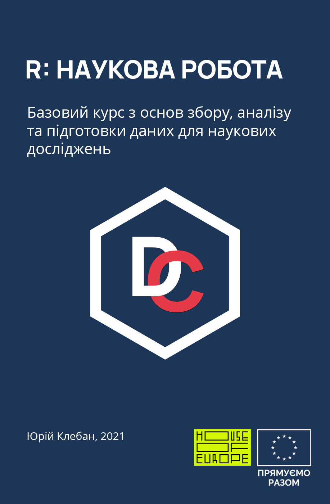

--- 
title: "Підготовка, обробка та ефективне використання даних для наукових досліджень"
author: "Юрій Клебан"
date: "2021-07-13"
site: bookdown::bookdown_site
documentclass: book
bibliography: [book.bib, packages.bib]
biblio-style: apalike
link-citations: yes
description: "Курс вступ до програмування в R, Проект DataClass"
favicon: "favicon.ico"
cover-image: "images/cover.png"
github-repo: "kleban/r-science-pub"
---

# Загальна інформація {-}

<i class="far fa-bell fa-alert fa-2x"></i>
Увага. Курс у процесі розробки. Матеріали додаватимуться по мірі їх написання та рецензування.

{#id .class width=75%}

Курс створено у межах проекту <strong>"Підготовка, обробка та ефективне використання даних для наукових досліджень (на основі R)"</strong>, що підтримує Європейський союз за програмою [House of Europe](https://houseofeurope.org.ua/).

Автори: Юрій Клебан, Новоселецький Олександр, Савчук Сергій, Бочаров Антон
